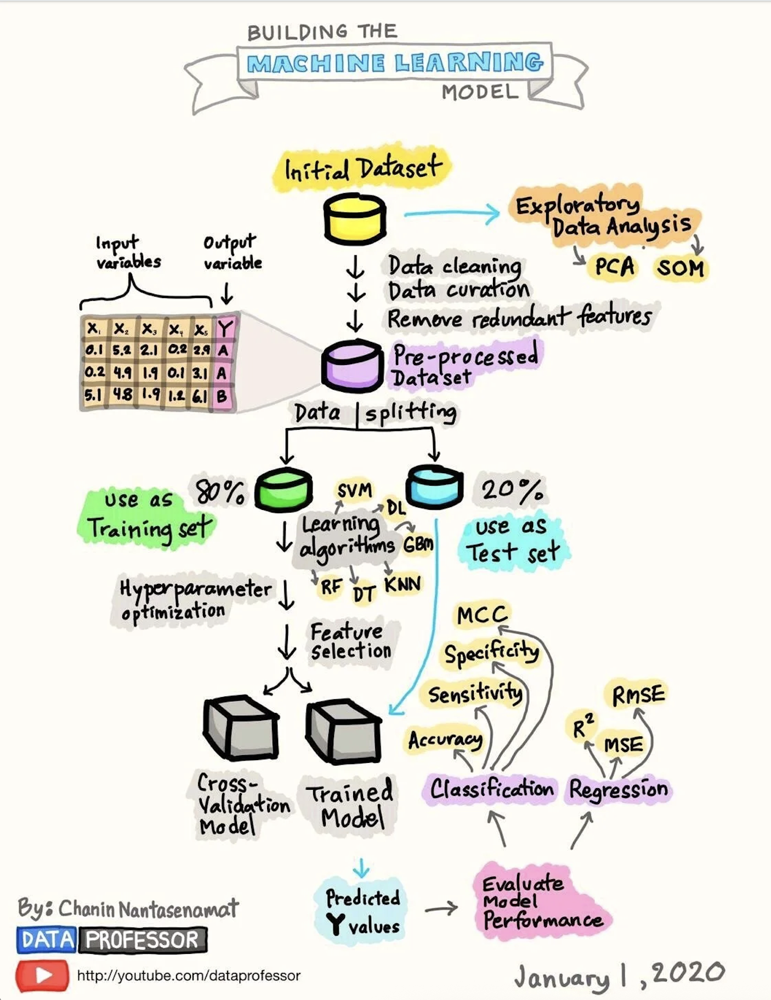

# 📘 ปัญญาประดิษฐ์

 

## 1. Artificial Intelligence คืออะไร  

**ปัญญาประดิษฐ์ (Artificial Intelligence: AI)** คือศาสตร์และเทคโนโลยีที่มุ่งเน้นการสร้าง “เครื่องจักรหรือระบบคอมพิวเตอร์” ให้สามารถทำงานที่โดยปกติแล้วต้องอาศัย **สติปัญญาของมนุษย์** เช่น การเรียนรู้ (Learning), การให้เหตุผล (Reasoning), การแก้ปัญหา (Problem Solving), การรับรู้สิ่งแวดล้อม (Perception) และการสื่อสารด้วยภาษา (Natural Language Processing)


### 🔹 ความหมายเชิงทฤษฎี

นักวิจัยด้าน AI กำหนดว่า AI คือ “ระบบที่สามารถรับข้อมูลจากสภาพแวดล้อม ประมวลผล และแสดงพฤติกรรมที่มีเป้าหมาย โดยปรับปรุงความสามารถผ่านการเรียนรู้” กล่าวคือ AI ไม่เพียงแต่ทำงานตามคำสั่งที่กำหนดไว้ล่วงหน้าเท่านั้น แต่ยังสามารถ **พัฒนาและปรับตัว** ตามสถานการณ์ใหม่ ๆ ได้


### 🔹 ขอบเขตของ AI

AI แบ่งออกได้เป็น 2 ระดับใหญ่:

1. **Weak AI (Narrow AI):** ออกแบบเพื่อทำงานเฉพาะด้าน เช่น ระบบแนะนำสินค้า (Recommendation Systems), ผู้ช่วยเสมือน (Virtual Assistants) อย่าง Siri หรือ Google Assistant
2. **Strong AI (General AI):** แนวคิดเชิงทฤษฎีที่ระบบสามารถคิด วิเคราะห์ และแก้ปัญหาได้ใกล้เคียงหรือเกินกว่ามนุษย์ในทุกด้าน (ยังไม่เกิดขึ้นจริง)


### 🔹 ตัวอย่างการประยุกต์ใช้

* **ด้านการแพทย์:** ระบบ AI วิเคราะห์ภาพเอกซเรย์เพื่อตรวจหาความผิดปกติ
* **ด้านการคมนาคม:** รถยนต์ไร้คนขับ (Autonomous Vehicles) ใช้ AI ตัดสินใจเส้นทางและความปลอดภัย
* **ด้านการสื่อสาร:** Chatbot และเครื่องแปลภาษาอัตโนมัติ เช่น Google Translate
* **ด้านธุรกิจ:** ระบบวิเคราะห์พฤติกรรมผู้บริโภค และคาดการณ์ยอดขาย


### 🔹 ความสำคัญทางวิชาการ

AI เป็นรากฐานของเทคโนโลยีสมัยใหม่ที่ส่งผลโดยตรงต่อวิทยาศาสตร์ คอมพิวเตอร์ เศรษฐศาสตร์ และสังคมศาสตร์ งานวิจัยด้าน AI ยังเชื่อมโยงกับ **Machine Learning (ML), Deep Learning (DL), และ Large Language Models (LLMs)** ซึ่งเป็นหัวใจสำคัญของ AI ยุคปัจจุบัน


👉 **สรุป:**
Artificial Intelligence คือการทำให้เครื่องจักรสามารถ “คิดและเรียนรู้” ได้ในระดับหนึ่ง เพื่อทำงานที่ปกติใช้สติปัญญาของมนุษย์ ช่วยเพิ่มประสิทธิภาพในหลากหลายด้าน และเป็นเทคโนโลยีสำคัญที่จะกำหนดอนาคตของมนุษย์และสังคม


## 2. Machine Learning คืออะไร  

**การเรียนรู้ของเครื่อง (Machine Learning: ML)** คือแขนงย่อยของปัญญาประดิษฐ์ (Artificial Intelligence: AI) ที่เน้นการสร้างแบบจำลองและอัลกอริทึมซึ่งทำให้คอมพิวเตอร์สามารถ **เรียนรู้จากข้อมูล (Data)** และ **ปรับปรุงประสิทธิภาพการทำงานโดยอัตโนมัติ** โดยไม่จำเป็นต้องมีการเขียนโปรแกรมกำหนดคำสั่งที่ละเอียดทุกขั้นตอน


### 🔹 ความหมายเชิงทฤษฎี

Arthur Samuel (1959) ให้คำจำกัดความว่า *“Machine Learning คือการทำให้คอมพิวเตอร์มีความสามารถในการเรียนรู้โดยไม่จำเป็นต้องถูกโปรแกรมให้ทำงานอย่างชัดเจน”*
ต่อมา Tom M. Mitchell (1997) ได้อธิบายเชิงวิชาการว่า *“โปรแกรมคอมพิวเตอร์ถูกกล่าวว่ามีความสามารถในการเรียนรู้จากประสบการณ์ (E) เกี่ยวกับงาน (T) และตัววัดประสิทธิภาพ (P) หากประสิทธิภาพในการทำงานของ (T) ซึ่งถูกวัดโดย (P) ดีขึ้นเมื่อได้รับประสบการณ์ (E)”*


### 🔹 ประเภทของ Machine Learning

1. **การเรียนรู้แบบมีผู้สอน (Supervised Learning):**

   * โมเดลเรียนรู้จากข้อมูลที่มีคำตอบกำกับ (label)
   * ตัวอย่าง: การจำแนกอีเมลเป็น spam หรือ ham
2. **การเรียนรู้แบบไม่มีผู้สอน (Unsupervised Learning):**

   * โมเดลเรียนรู้จากข้อมูลที่ไม่มี label โดยพยายามหาความสัมพันธ์หรือโครงสร้างแฝง
   * ตัวอย่าง: การจัดกลุ่มลูกค้า (Customer Segmentation)
3. **การเรียนรู้แบบเสริมกำลัง (Reinforcement Learning):**

   * ตัวแทน (Agent) เรียนรู้จากการลองผิดลองถูก โดยได้รับรางวัล (reward) หรือโทษ (penalty)
   * ตัวอย่าง: หุ่นยนต์เรียนรู้การเดิน, โปรแกรมเล่นเกมโกะ


### 🔹 ตัวอย่างการประยุกต์ใช้ Machine Learning

* **การแพทย์:** ใช้วิเคราะห์ข้อมูลภาพ MRI เพื่อตรวจหามะเร็ง
* **การเงิน:** ใช้ตรวจจับธุรกรรมที่ผิดปกติ (Fraud Detection)
* **การตลาด:** ระบบแนะนำสินค้า (Recommendation Systems) เช่น Netflix, YouTube
* **การศึกษา:** ระบบสอนเสริมอัจฉริยะที่ปรับเนื้อหาให้ตรงกับผู้เรียน

### การสร้างสร้าง Machine Learning

การเรียนรู้ของเครื่อง (Machine Learning: ML) ถือเป็นแขนงย่อยที่สำคัญของปัญญาประดิษฐ์ (Artificial Intelligence: AI) โดยมีวัตถุประสงค์หลักคือทำให้คอมพิวเตอร์สามารถเรียนรู้จากข้อมูลและปรับปรุงประสิทธิภาพการทำงานได้เอง กระบวนการพัฒนา ML ไม่ได้อาศัยเพียงการเลือกอัลกอริทึมที่เหมาะสม แต่ยังต้องดำเนินการตามขั้นตอนที่เป็นระบบตั้งแต่การเตรียมข้อมูล การฝึกโมเดล การประเมินผล ไปจนถึงการนำไปใช้งานจริง




**1. การกำหนดปัญหาและตัวชี้วัด (Problem Definition & Metrics)**

ขั้นแรกต้องระบุให้ชัดเจนว่าปัญหาที่กำลังแก้เป็นปัญหาประเภทใด เช่น การจำแนกประเภท (classification), การถดถอย (regression) หรือการจัดกลุ่ม (clustering) รวมถึงการเลือกตัวชี้วัดประสิทธิภาพที่เหมาะสม เช่น Accuracy, Precision, Recall และ F1-score สำหรับการจำแนกประเภท หรือ MSE, RMSE, และ ($R^2$) สำหรับการถดถอย

 
**2. การรวบรวมข้อมูล (Data Collection)**

ข้อมูลเป็นวัตถุดิบหลักของ ML แหล่งข้อมูลอาจมาจากฐานข้อมูลภายใน, API, IoT, ภาพถ่าย หรือข้อความ คุณภาพของข้อมูลมีผลโดยตรงต่อคุณภาพของโมเดล ดังนั้นการเลือกและรวบรวมข้อมูลที่เหมาะสมจึงเป็นขั้นตอนสำคัญ


**3. การสำรวจข้อมูลเบื้องต้น (Exploratory Data Analysis: EDA)**

การสำรวจข้อมูลช่วยให้เข้าใจโครงสร้างและคุณภาพของข้อมูล ใช้สถิติพรรณนาและการแสดงผลด้วยกราฟเพื่อค้นหารูปแบบและความผิดปกติ เทคนิคอย่าง PCA (Principal Component Analysis) หรือ SOM (Self-Organizing Map) สามารถใช้ในการลดมิติหรือหาความสัมพันธ์เชิงลึกได้

 

**4. การทำความสะอาดและเตรียมข้อมูล (Data Cleaning & Pre-processing)**

ข้อมูลดิบมักมีค่าที่หายไป ค่าผิดปกติ หรือมีความไม่สอดคล้อง การทำความสะอาดจึงรวมถึงการจัดการ missing values, การลบหรือปรับ outliers, การแปลงค่าตัวแปรหมวดหมู่เป็นตัวเลข (One-Hot Encoding) และการปรับสเกลข้อมูล (Normalization/Standardization)

**5. การสร้างและคัดเลือกคุณลักษณะ (Feature Engineering & Selection)**

การสร้างคุณลักษณะใหม่ (Feature Engineering) เช่น การสร้างฟีเจอร์เวลา หรือการใช้ TF-IDF สำหรับข้อความ และการคัดเลือกคุณลักษณะ (Feature Selection) ช่วยให้โมเดลเรียนรู้ได้อย่างมีประสิทธิภาพ ลดมิติข้อมูล และป้องกัน Overfitting


**6. การแบ่งชุดข้อมูล (Data Splitting)**

ข้อมูลถูกแบ่งเป็น Training set และ Test set (เช่น 80/20) โดย Training set ใช้ในการฝึกโมเดล ส่วน Test set ใช้ในการประเมินผลการทำนายที่ไม่เคยเห็นมาก่อน เพื่อสะท้อนสมรรถนะจริงของโมเดล

**7. การเลือกอัลกอริทึม (Model Selection)**

โมเดลที่ใช้ขึ้นอยู่กับลักษณะของงาน เช่น Logistic Regression, Decision Tree, Random Forest, SVM, Neural Networks หรือ Gradient Boosting Machine การเลือกโมเดลพิจารณาจากความซับซ้อน ข้อจำกัดด้านเวลา และทรัพยากร

**8. การฝึกและการปรับจูน (Model Training & Hyperparameter Optimization)**

โมเดลถูกฝึกด้วย Training set โดยการปรับค่าพารามิเตอร์ภายใน (weights) ขณะเดียวกันยังต้องปรับค่าพารามิเตอร์ภายนอก (Hyperparameters) เช่น learning rate, จำนวน tree, หรือค่า k ของ kNN เทคนิคที่ใช้ เช่น Grid Search หรือ Random Search

**9. การตรวจสอบไขว้ (Cross-Validation)**

การใช้ k-Fold Cross-Validation ช่วยประเมินความสามารถทั่วไปของโมเดล และตรวจสอบปัญหา Overfitting/Underfitting โดยดูความแตกต่างของผลลัพธ์ระหว่างชุด train และ validation


**10. การประเมินผล (Evaluation)**

การประเมินใช้ Test set และ Metrics ที่เลือกในขั้นตอนแรก เช่น Accuracy, Precision, Recall, F1-score สำหรับการจำแนกประเภท หรือ RMSE และ (R^2) สำหรับการถดถอย รวมถึงการวิเคราะห์ Confusion Matrix และ Error Analysis เพื่อหาสาเหตุของความผิดพลาด

**11. การนำไปใช้จริง (Deployment)**

โมเดลที่ผ่านการประเมินแล้วสามารถนำไปใช้ในสภาพแวดล้อมจริง เช่น ผ่าน API หรือเชื่อมกับระบบสารสนเทศเดิม โดยต้องคำนึงถึงประสิทธิภาพ ความปลอดภัย และการทำงานแบบ real-time

**12. การติดตามและบำรุงรักษา (Monitoring & Maintenance)**

เมื่อข้อมูลและสภาพแวดล้อมเปลี่ยน โมเดลอาจเสื่อมคุณภาพ (Model Drift) จึงต้องมีการติดตาม ตรวจสอบผลการทำงาน และปรับปรุงหรือ retrain อย่างต่อเนื่อง

**สรุป**
Machine Learning Process เป็นวงจรที่เริ่มจากการเก็บข้อมูล → เตรียมข้อมูล → ฝึกโมเดล → ประเมินผล → นำไปใช้จริง และสิ้นสุดด้วยการติดตามและปรับปรุงอย่างต่อเนื่อง การเข้าใจและปฏิบัติตามขั้นตอนเหล่านี้เป็นรากฐานสำคัญของการประยุกต์ใช้ ML ในโลกวิชาการและอุตสาหกรรม

 


### 🔹 ความสำคัญทางวิชาการ

Machine Learning ถือเป็น **หัวใจของ AI ยุคใหม่** เพราะเปิดโอกาสให้คอมพิวเตอร์พัฒนา “พฤติกรรม” ของตนเองโดยใช้ข้อมูลเป็นตัวขับเคลื่อน ทั้งยังเป็นพื้นฐานสำคัญของเทคโนโลยีขั้นสูง เช่น **Deep Learning, Computer Vision, Natural Language Processing และ Large Language Models (LLMs)**


👉 **สรุป:**
Machine Learning คือวิธีการทำให้คอมพิวเตอร์เรียนรู้จากข้อมูลเพื่อพัฒนาความสามารถของตนเอง สามารถปรับใช้ได้หลากหลาย และเป็นสะพานเชื่อมระหว่าง **แนวคิดของ AI** และ **การใช้งานจริงในชีวิตประจำวัน**


## 3. Deep Learning Model คืออะไร  

### 🔹 ความหมาย

**Deep Learning Model (แบบจำลองการเรียนรู้เชิงลึก)** คือแบบจำลองทางคณิตศาสตร์ที่ใช้ **โครงข่ายประสาทเทียม (Artificial Neural Networks)** ซึ่งได้รับแรงบันดาลใจจากการทำงานของสมองมนุษย์ โดยมีโครงสร้างพื้นฐานเป็น **ชั้นของนิวรอน (neurons)** ที่เชื่อมโยงกันเป็นเครือข่าย ข้อมูลจะถูกส่งผ่านแต่ละชั้นเพื่อ “เรียนรู้รูปแบบ” ที่ซ่อนอยู่


### 🔹 การใช้งานที่สำคัญ

Deep Learning ถูกนำไปใช้ในหลายสาขา เช่น:

1. **การจำภาพ (Image Recognition):** เช่น การตรวจจับใบหน้า การแยกแมว/สุนัขในภาพถ่าย
2. **การรู้จำเสียงพูด (Speech Recognition):** เช่น Google Voice, Siri หรือระบบแปลงเสียงเป็นข้อความ
3. **การทำนายข้อมูล (Prediction):** เช่น การพยากรณ์ราคาหุ้น การคาดการณ์สภาพอากาศ


### 🔹 ตัวอย่างที่นักเรียนเข้าใจง่าย

* **การจำภาพแมว/สุนัข:** โมเดลจะถูกฝึกด้วยภาพจำนวนมาก เมื่อเจอภาพใหม่ ก็สามารถทำนายได้ว่าเป็นแมวหรือสุนัข
* **การทำนายราคาหุ้น:** ใช้ข้อมูลราคาที่ผ่านมาเป็นตัวอย่าง → โมเดลเรียนรู้รูปแบบ → นำไปใช้คาดการณ์ราคาที่จะเกิดขึ้นในอนาคต


### 🔹 ข้อจำกัดของ Deep Learning Model

แม้จะทรงพลัง แต่ Deep Learning Model ก็มีข้อจำกัดที่ควรรู้:

1. **Task-specific (เฉพาะงาน):** ส่วนใหญ่ทำงานได้ดีเฉพาะสิ่งที่ถูกฝึก เช่น ถ้าโมเดลถูกสอนให้แยกแมว/สุนัข ก็ไม่สามารถไปแปลภาษาได้
2. **ไม่เข้าใจภาษาอย่างแท้จริง:** แม้จะรู้จักการประมวลผลข้อความ เช่น การวิเคราะห์อารมณ์ (sentiment analysis) แต่ไม่สามารถสร้างประโยคที่ซับซ้อนหรือเข้าใจบริบทได้เหมือนมนุษย์


### 🔹 Key Takeaway 

Deep Learning คือ **รากฐานของปัญญาประดิษฐ์ยุคใหม่** และถูกใช้ในชีวิตประจำวันของเราหลายด้าน เช่น Facebook ที่จำใบหน้า, Google Translate ที่รู้จำเสียงพูด แต่ก็ยังมีข้อจำกัดที่ทำให้ต้องพัฒนาไปสู่ **LLMs** ซึ่งเก่งด้าน “ภาษา” มากกว่า

## 4. Language Model

LLMs ทำงานบนหลักการสำคัญของ **การประมาณความน่าจะเป็นของลำดับคำ** (*Sequence Modeling*) กล่าวคือ โมเดลจะพยายามเรียนรู้ความสัมพันธ์ของคำในประโยค เพื่อทำนายคำถัดไปที่มีความน่าจะเป็นสูงสุด

### **สมการพื้นฐาน**

โมเดลคำนวณความน่าจะเป็นของข้อความ $X$ ที่ประกอบด้วยลำดับของคำ $(w_1, w_2, ..., w_n)$ ตามสูตร:

$$
P(X) = P(w_1, w_2, ..., w_n) = \prod_{t=1}^{n} P(w_t | w_1, w_2, ..., w_{t-1})
$$

ซึ่งหมายความว่า **ความน่าจะเป็นของคำในตำแหน่งที่ $t$** ขึ้นกับบริบทก่อนหน้า $(w_1 ... w_{t-1})$

**ตัวอย่าง:**

> ประโยค: "ฉันกำลังเขียน \_\_\_"
> โมเดลจะพิจารณาบริบทก่อนหน้า ("ฉันกำลังเขียน") เพื่อทำนายคำที่มีความน่าจะเป็นสูงสุด เช่น:

* "โปรแกรม"
* "บทความ"
* "จดหมาย"

## การแปลงข้อความเป็นตัวเลข (Tokenization & Embeddings)**

เนื่องจากโมเดล Deep Learning ไม่สามารถประมวลผลตัวอักษรโดยตรง จึงต้องมีขั้นตอน **แปลงข้อความ → ตัวเลข** ผ่านสองกระบวนการสำคัญ:

### **(a) Tokenization**

* **Token** คือหน่วยย่อยของข้อความ เช่น ตัวอักษร คำ หรือพยางค์
* โมเดล LLM เช่น GPT ใช้วิธี **Byte-Pair Encoding (BPE)** หรือ **SentencePiece** เพื่อแบ่งข้อความออกเป็น tokens
* ตัวอย่างการ Tokenize:

  ```
  "สวัสดีครับ" → ["สวั", "สดี", "ครับ"]
  ```

### **(b) Embeddings**

* Token แต่ละตัวจะถูกแปลงเป็น **เวกเตอร์เชิงตัวเลข** (Vector Representation) ในมิติสูง ๆ เช่น 1,024 มิติ หรือ 4,096 มิติ
* เวกเตอร์นี้ทำให้โมเดลสามารถ "เข้าใจ" ความหมายและความสัมพันธ์ระหว่างคำ เช่น:

  ```
  Embedding("แมว") ≈ [0.12, -0.56, 0.34, ...]
  Embedding("สุนัข") ≈ [0.15, -0.53, 0.31, ...]
  ```
* เมื่อวัดระยะทางของเวกเตอร์ด้วย **Cosine Similarity** จะพบว่า "แมว" และ "สุนัข" ใกล้กันมากกว่า "แมว" กับ "รถยนต์" → โมเดลจึงเข้าใจความเชิงความหมายของคำ


## 5. LLM (Large Language Model) คืออะไร

### 🔹 ความหมาย

**LLM (Large Language Model)** คือโมเดลปัญญาประดิษฐ์ที่ถูกออกแบบมาเพื่อทำงานกับ **ภาษาธรรมชาติ (Natural Language)** โดยใช้สถาปัตยกรรม **Transformer** ซึ่งมีความสามารถในการประมวลผลข้อความยาว ๆ และเข้าใจความสัมพันธ์ของคำในบริบทได้อย่างลึกซึ้งกว่าวิธีการแบบเดิม เช่น RNN หรือ LSTM


### 🔹 กระบวนการเรียนรู้ของ LLM

* LLM ถูก **ฝึก (train)** ด้วยข้อมูลข้อความจำนวนมหาศาล เช่น หนังสือ บทความ เว็บไซต์
* โมเดลเรียนรู้จาก “รูปแบบ” และ “ความสัมพันธ์ของคำ” ในข้อความเหล่านั้น
* ผลลัพธ์คือ LLM สามารถ **ทำนายคำถัดไป** ได้ถูกต้องมากขึ้น
* ตัวอย่าง: ถ้าพิมพ์ว่า *“กรุงเทพมหานครเป็นเมืองหลวงของ…”* → LLM จะตอบ *“ประเทศไทย”*


### 🔹 คุณสมบัติหลักของ LLM

1. **การสร้างข้อความใหม่ (Text Generation):** แต่งเรื่อง เขียนเรียงความ หรือสร้างคำบรรยายภาพ
2. **การตอบคำถาม (Question Answering):** ตอบข้อสงสัยจากผู้ใช้โดยอ้างอิงความรู้ที่ฝึกมา
3. **การแปลภาษา (Translation):** แปลข้อความจากภาษาไทยเป็นอังกฤษ หรือภาษาอื่น ๆ
4. **การสรุปเนื้อหา (Summarization):** ย่อบทความยาว ๆ ให้สั้นและเข้าใจง่ายขึ้น
5. **การช่วยเขียนโค้ด (Code Generation):** สร้างโค้ดเบื้องต้น อธิบายโค้ด หรือแก้บั๊กโปรแกรมได้


### 🔹 ตัวอย่างที่นักเรียนคุ้นเคย

* **ChatGPT:** ตอบคำถามทั่วไปและเขียนบทความ
* **Google Bard (Gemini):** ผู้ช่วยด้านการค้นหาข้อมูลและการเขียน
* **LLaMA:** โมเดลโอเพ่นซอร์สจาก Meta ที่นักวิจัยนำไปปรับแต่งเองได้
* **Claude:** โมเดลจาก Anthropic ที่เน้นความปลอดภัยและการโต้ตอบที่เป็นธรรมชาติ


### 🔹 Key Point สำหรับนักเรียน ม.ปลาย

* LLM คือ **โมเดลที่ถูกสอนให้ “อ่าน–เขียน–เข้าใจภาษา” เหมือนมนุษย์**
* จุดเด่นอยู่ที่ **ความยืดหยุ่น**: สามารถทำงานด้านภาษาได้หลายรูปแบบ โดยไม่ต้องสร้างโมเดลใหม่สำหรับแต่ละงาน
* จึงเป็นเหตุผลว่าทำไมเราถึงใช้ LLM ในชีวิตประจำวัน เช่น ChatGPT ที่ช่วยทำการบ้าน หรือ Google Translate ที่แปลภาษาได้อย่างรวดเร็ว


👉 **สรุปสั้น:**
LLM คือก้าวกระโดดของ AI ในด้านภาษา มันไม่ใช่แค่จำข้อมูล แต่สามารถสร้างประโยคใหม่ ๆ ได้ และนี่คือจุดที่ทำให้มันแตกต่างจาก Deep Learning Model ทั่วไป
ความหมาย, คุณสมบัติ, ตัวอย่าง) สำหรับหัวข้อนี้เลยไหมครับ?


## 6. LLM ต่างจาก Deep Learning Model อย่างไร 

| ประเด็น           | Deep Learning Model ทั่วไป             | LLM                                      |
| ----------------- | -------------------------------------- | ---------------------------------------- |
| **ขนาดข้อมูลฝึก** | ใช้ข้อมูลเฉพาะงาน เช่น รูปภาพแมว/สุนัข | ใช้ข้อความจำนวนมหาศาล ครอบคลุมหลายหัวข้อ |
| **วัตถุประสงค์**  | เน้นงานเฉพาะ เช่น ทำนาย, จำแนกภาพ      | ทำงานทั่วไปด้านภาษา ครอบคลุมกว้าง        |
| **การเรียนรู้**   | เรียนรู้จากตัวอย่างแคบ ๆ               | เรียนรู้โครงสร้างภาษาและบริบท            |
| **ความยืดหยุ่น**  | ต้องฝึกใหม่หากเปลี่ยนงาน               | ใช้ “Prompt” ชี้นำ → ทำงานได้หลายแบบ     |
| **ตัวอย่าง**      | ResNet (ภาพ), RNN/LSTM (ลำดับข้อมูล)   | GPT, LLaMA, PaLM                         |
