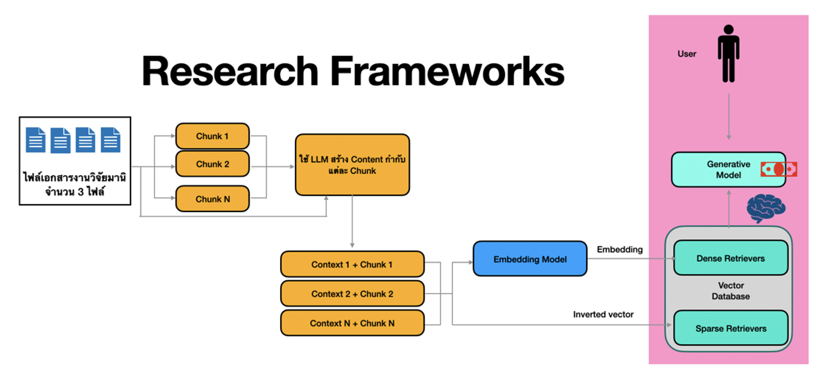

# 04 - สร้าง AI ตอบคำถามจากเอกสาร ด้วย RAG Framework


## 🧭 1. บทนำ : ทำไมต้องให้ AI อ่านเอกสารได้

ในยุคปัจจุบัน ปัญหาหลักของนักเรียนและนักวิจัยคือ **“ข้อมูลเยอะเกินไป” (Information Overload)**
เรามีข้อมูลทั้งจากหนังสือเรียน บทความวิจัย เว็บไซต์ และฐานข้อมูลดิจิทัลจำนวนมาก จนเกินกว่าที่มนุษย์จะอ่านและทำความเข้าใจได้ทันเวลา

ปรากฏการณ์นี้เรียกว่า **“Big Knowledge Problem”** — คือปริมาณความรู้ที่มากเกินขีดจำกัดการประมวลผลของมนุษย์ (Cognitive Load Theory) ซึ่งทำให้ผู้เรียนไม่สามารถกรองสาระสำคัญได้อย่างมีประสิทธิภาพ


### 🔹 บทบาทของ AI ต่อการจัดการข้อมูล (AI for Knowledge Management)

เพื่อแก้ปัญหานี้ นักวิทยาการคอมพิวเตอร์ได้นำเทคโนโลยี **Artificial Intelligence (AI)** มาช่วยในกระบวนการ “อ่าน ค้นหา และสรุปความรู้”
AI ที่ใช้ในการจัดการข้อมูลเชิงข้อความ (Textual Data) จะอาศัยแขนงย่อยของ AI ที่เรียกว่า **Natural Language Processing (NLP)**

NLP ทำให้คอมพิวเตอร์สามารถเข้าใจ “ภาษามนุษย์” ได้ เช่น

* การแยกประโยคและคำ (Tokenization)
* การทำความเข้าใจความหมาย (Semantic Analysis)
* การสรุปใจความ (Summarization)
* การตอบคำถาม (Question Answering)

กล่าวได้ว่า NLP คือ “สะพาน” ระหว่างภาษา (Language) กับตรรกะทางคอมพิวเตอร์ (Computation)


### 🔹 การพัฒนาไปสู่ยุคของ Large Language Models (LLMs)

ในช่วงไม่กี่ปีที่ผ่านมา เทคโนโลยีได้ก้าวสู่ **Large Language Models (LLMs)**
เช่น **ChatGPT, Gemini, Claude, LLaMA 3** ซึ่งถูกฝึกด้วยข้อมูลข้อความจำนวนมหาศาลระดับหลายพันล้านคำ

โมเดลเหล่านี้เรียนรู้ “โครงสร้างและความสัมพันธ์ทางภาษา” ทำให้สามารถ

* เขียนข้อความ
* สรุปเนื้อหา
* แปลภาษา
* และตอบคำถามได้อย่างเป็นธรรมชาติ

อย่างไรก็ตาม LLM มีข้อจำกัดทางทฤษฎีที่สำคัญคือ

> มัน “ไม่สามารถอ้างอิงข้อมูลใหม่หรือเฉพาะทาง” ได้โดยตรง
> เพราะฐานความรู้ของมันถูกจำกัดอยู่ในช่วงเวลาที่ถูกฝึก (Training Cutoff)


### 🔹 การเสริมความสามารถด้วย Retrieval-Augmented Generation (RAG)

เพื่อตอบโจทย์นี้ นักวิจัยจึงพัฒนาแนวคิด **Retrieval-Augmented Generation (RAG)**
ซึ่งเป็นสถาปัตยกรรม AI แบบลูกผสม (Hybrid Architecture) ที่รวม

1. **Retrieval System (ระบบค้นหาเชิงความหมาย)**
2. **Generative Model (โมเดลสร้างภาษา)**

เข้าไว้ด้วยกันในวงจรเดียว

#### 🔸 ส่วนที่ 1: Retrieval

ระบบจะ **ดึงข้อมูลจากแหล่งจริง (Knowledge Base)**
เช่น เอกสาร บทเรียน บทความวิจัย หรือฐานข้อมูลโรงเรียน
โดยใช้เทคนิค **Vector Search** — การแปลงข้อความเป็น “เวกเตอร์ตัวเลข”
เพื่อให้ AI ค้นหาความหมายที่ “ใกล้เคียง” กับคำถามของผู้ใช้
(ไม่ใช่แค่คำตรงตัวแบบ Search Engine ทั่วไป)

#### 🔸 ส่วนที่ 2: Generation

หลังจากระบบค้นหาเจอข้อมูลที่เกี่ยวข้อง
AI จะนำข้อมูลนั้นมา “ต่อยอด” ด้วยการสังเคราะห์คำตอบ
โดยใช้โมเดลภาษา (เช่น GPT หรือ Gemini) เพื่อสร้างข้อความใหม่
ที่มีความถูกต้องตามบริบทและอ่านเข้าใจง่าย


### 🔹 การอธิบายเชิงกลไก (Theoretical Mechanism of RAG)

RAG สามารถมองได้เป็นสมการทางแนวคิดดังนี้


$\text{Answer} = \text{LLM}(\text{Prompt} + \text{Retrieved Context})$


* **Prompt** = คำถามของผู้ใช้
* **Retrieved Context** = ข้อความที่ระบบค้นหามาได้จากแหล่งข้อมูลจริง
* **LLM(...)** = โมเดลภาษาที่สร้างคำตอบจากบริบทดังกล่าว

ในเชิงคณิตศาสตร์ การทำงานของระบบ Retrieval จะใช้ **Cosine Similarity**
เพื่อวัด “ระยะห่างเชิงความหมาย” ระหว่างคำถามกับเอกสาร

$\text{similarity}(A, B) = \frac{A \cdot B}{||A|| \times ||B||}$

เมื่อค่า similarity ใกล้ 1.0 → เอกสารนั้นมีเนื้อหาใกล้เคียงกับคำถามมากที่สุด


### 🔹 ประโยชน์เชิงทฤษฎีของ RAG

| ด้าน                              | คำอธิบาย                                                       |
| --------------------------------- | -------------------------------------------------------------- |
| 🧠 **Cognitive Load Reduction**   | ช่วยลดภาระทางปัญญาของผู้เรียน เพราะ AI ช่วยกรองและสรุปข้อมูล   |
| 🔍 **Knowledge Grounding**        | เพิ่มความแม่นยำของ LLM โดยอิงข้อมูลจริง                        |
| 🔄 **Dynamic Knowledge Updating** | สามารถอัปเดตฐานข้อมูลความรู้ได้ตลอดเวลา โดยไม่ต้องฝึกโมเดลใหม่ |
| 🧩 **Explainable AI (XAI)**       | การค้นหาแหล่งอ้างอิงก่อนตอบ ทำให้คำตอบสามารถตรวจสอบย้อนกลับได้ |


### 🔹 ตัวอย่างเชิงสถานการณ์

> นักเรียนถาม: “ระบบประสาททำงานอย่างไร?”
>
> ✅ **RAG จะทำงานดังนี้:**
>
> 1. ค้นหาข้อความจากบทเรียนวิทยาศาสตร์ที่เกี่ยวข้องกับ “ระบบประสาท”
> 2. สกัดย่อหน้าที่อธิบายกลไกการส่งสัญญาณของเซลล์ประสาท
> 3. นำข้อมูลนั้นมาสร้างคำตอบเป็นภาษาที่เข้าใจง่าย เช่น
>    “ระบบประสาททำงานโดยส่งสัญญาณไฟฟ้าผ่านเซลล์ประสาทจากสมองไปยังส่วนต่าง ๆ ของร่างกาย”

ผลลัพธ์นี้สะท้อนการ “เข้าใจบริบท + อ้างอิงข้อมูลจริง” ซึ่งเป็นหัวใจของ RAG Framework


### 🔹 สรุปเชิงทฤษฎีของบทนำ

| แนวคิดหลัก                               | คำอธิบาย                                   |
| ---------------------------------------- | ------------------------------------------ |
| **Information Overload**                 | ปริมาณข้อมูลมากเกินกว่ามนุษย์จะประมวลผลได้ |
| **NLP (Natural Language Processing)**    | ทำให้คอมพิวเตอร์เข้าใจภาษา                 |
| **LLM (Large Language Model)**           | โมเดลภาษา AI ที่สร้างข้อความได้            |
| **RAG (Retrieval-Augmented Generation)** | การเสริมพลัง LLM ด้วยการค้นหาข้อมูลจริง    |
| **Vector Search**                        | การค้นหาความหมายของข้อความด้วยตัวเลข       |
| **Cosine Similarity**                    | การวัดความใกล้กันของข้อความเชิงความหมาย    |


## 🔍 2. ทฤษฎีพื้นฐานที่เกี่ยวข้อง  

### 2.1 Natural Language Processing (NLP)

**NLP หรือ การประมวลผลภาษาธรรมชาติ**
เป็นสาขาหนึ่งของปัญญาประดิษฐ์ที่ทำให้คอมพิวเตอร์ “เข้าใจ ตีความ และสร้างภาษา” ได้ในลักษณะเดียวกับมนุษย์

#### 📘 พื้นฐานทางทฤษฎี

แนวคิดของ NLP มีรากมาจากสองสายหลักคือ

* **ภาษาศาสตร์คอมพิวเตอร์ (Computational Linguistics)** ซึ่งมุ่งอธิบายโครงสร้างทางภาษา (ไวยากรณ์ และ ความหมาย) ในเชิงตรรกะ
* **AI เชิงสถิติ (Statistical AI)** ที่ใช้ข้อมูลจำนวนมากเพื่อให้คอมพิวเตอร์ “เรียนรู้รูปแบบ” ของภาษาโดยอัตโนมัติ

กระบวนการหลักของ NLP สามารถอธิบายเชิงลึกได้ดังนี้ 👇

| ขั้นตอน                    | ความหมาย                                                       | หลักการทางทฤษฎี                                                                          |
| -------------------------- | -------------------------------------------------------------- | ---------------------------------------------------------------------------------------- |
| **Tokenization**           | การแยกประโยคหรือคำออกจากกัน                                    | ใช้กฎทางไวยากรณ์หรือโมเดล Probabilistic เช่น WordPiece, BPE                              |
| **Embedding**              | การแปลงคำหรือประโยคเป็นเวกเตอร์ตัวเลขที่เก็บ “ความหมายเชิงนัย” | อิงทฤษฎี Distributional Semantics ที่ว่า *“คำที่อยู่ในบริบทคล้ายกัน มีความหมายใกล้กัน”*  |
| **Semantic Understanding** | การเข้าใจความสัมพันธ์และเจตนาของประโยค                         | ใช้ Deep Neural Networks แบบ Transformer และกลไก Attention เพื่อจับความสัมพันธ์ระหว่างคำ |
| **Generation**             | การสร้างข้อความใหม่ที่สอดคล้องกับบริบท                         | ใช้โมเดล Decoder หรือ Seq-to-Seq คาดเดาคำถัดไปในลำดับภาษา                                |

> 🧠 ตัวอย่าง: เมื่อ AI เห็นคำว่า “แมว กำลังกิน...” โมเดลจะคาดเดาคำต่อไปที่มีความน่าจะเป็นสูง เช่น “ปลา” หรือ “อาหาร”


### 2.2 Large Language Model (LLM)

**LLM คือโมเดลภาษาขนาดใหญ่** ที่เรียนรู้จากข้อความจำนวนมหาศาล (ระดับหลายร้อยพันล้านคำ) และใช้สถาปัตยกรรม **Transformer** ซึ่งพัฒนาโดย Vaswani et al. (2017)

#### 🔹 หลักการทางทฤษฎี

LLM ใช้แนวคิดของ **Self-Attention Mechanism** เพื่อให้โมเดลเข้าใจความสัมพันธ์ระหว่างคำทั้งหมดในประโยค พร้อมกัน ไม่ใช่ทีละคำเหมือน RNN หรือ LSTM

โมเดลจะเรียนรู้ **ความน่าจะเป็นของลำดับคำ (Sequence Probability)** ดังนี้ ↓

$
P(w_1, w_2, ..., w_n) = \prod_{i=1}^{n} P(w_i | w_1, w_2, ..., w_{i-1})
$

โมเดลที่มีขนาดใหญ่ (พารามิเตอร์หลายพันล้านค่า) จะสามารถ “เข้าใจบริบท” ได้ลึกขึ้น และสามารถสรุปหรือสร้างข้อความใหม่ได้อย่างมีความหมาย

#### 🔸 ขอบเขตและข้อจำกัดของ LLM

* ✅ เข้าใจบริบทของภาษาได้ดี และสามารถสรุป เขียน หรือแปลข้อความได้
* ❌ **ไม่สามารถเข้าถึงข้อมูลใหม่หรือเฉพาะของผู้ใช้ได้โดยตรง** เพราะความรู้ถูกจำกัดในข้อมูลตอนฝึก
* ❌ อาจเกิด **Hallucination** คือสร้างข้อมูลที่ดูสมจริงแต่ไม่ตรงกับความจริง

เพื่อลดข้อจำกัดนี้ จึงเกิดแนวทาง **Retrieval-Augmented Generation (RAG)**


### 2.3 Retrieval-Augmented Generation (RAG)

**RAG เป็นสถาปัตยกรรมลูกผสม (Hybrid Architecture)** ที่เชื่อมระหว่างระบบค้นหาข้อมูล (Information Retrieval) และ โมเดลภาษา (LLM) เข้าด้วยกัน

#### 🔹 แนวคิดหลักของ RAG

| ขั้นตอน          | คำอธิบาย                                                                                       |
| ---------------- | ---------------------------------------------------------------------------------------------- |
| **Retrieval**    | ระบบค้นหาข้อมูลจากฐานความรู้หรือเอกสารที่จัดเก็บไว้ โดยใช้ Vector Database และ Semantic Search |
| **Augmentation** | ข้อมูลที่ค้นได้จะถูกนำมาประกอบเป็นบริบท (Context) เพิ่มเติมให้ LLM ก่อนสร้างคำตอบ              |
| **Generation**   | โมเดลภาษา LLM จะสร้างคำตอบใหม่โดยอิงจากบริบทที่ได้จากการค้นหา                                  |


#### 🔹 กลไกการทำงานเชิงคณิตศาสตร์

1. แปลงข้อความและคำถามให้เป็นเวกเตอร์ ( v_d, v_q )
2. วัดความใกล้เคียงด้วย **Cosine Similarity**

[
\text{similarity}(v_q, v_d) = \frac{v_q \cdot v_d}{||v_q|| \times ||v_d||}
]

3. เลือกเอกสารที่มีค่าความใกล้เคียงสูงสุด
4. ส่งข้อมูลเหล่านั้นเข้าไปยัง LLM เพื่อสร้างคำตอบใหม่


#### 🔹 ประโยชน์เชิงทฤษฎีของ RAG

| ด้าน                   | คำอธิบาย                                                            |
| ---------------------- | ------------------------------------------------------------------- |
| **Grounded Knowledge** | คำตอบของ LLM อิงกับข้อมูลจริง ทำให้ลดความคลาดเคลื่อน                |
| **Dynamic Updating**   | สามารถอัปเดตความรู้ได้ทันที เพียงเพิ่มเอกสาร โดยไม่ต้องฝึกโมเดลใหม่ |
| **Explainability**     | สามารถตรวจสอบที่มาของข้อมูลได้ (Traceable Answer)                   |
| **Cognitive Support**  | ช่วยลดภาระการอ่านของผู้เรียน ตามแนวคิด Cognitive Load Theory        |


#### 🔹 สรุปภาพรวมความสัมพันธ์ของ NLP – LLM – RAG

| ชั้นทฤษฎี       | บทบาท                                | เทคโนโลยีตัวอย่าง                    |
| --------------- | ------------------------------------ | ------------------------------------ |
| **NLP พื้นฐาน** | ทำให้คอมพิวเตอร์เข้าใจภาษา           | Tokenization / POS Tagging / Parsing |
| **LLM**         | สร้างข้อความที่เข้าใจได้เหมือนมนุษย์ | ChatGPT / Gemini / LLaMA 3           |
| **RAG**         | ทำให้ LLM ตอบคำถามจากข้อมูลจริงได้   | LangChain / FAISS / Chroma + LLM API |


> 🧩 **สรุปเชิงทฤษฎี:**
>
> * NLP คือพื้นฐานในการเข้าใจภาษา
> * LLM คือเครื่องมือสร้างภาษา
> * RAG คือการผสาน LLM กับฐานความรู้จริง เพื่อให้ได้คำตอบที่ “ถูกต้อง และ เข้าใจง่าย”

 
## ⚙️ 3. โครงสร้างระบบ RAG  

RAG Framework ประกอบด้วยกระบวนการสำคัญ 5 ขั้นตอนหลัก
แต่ละขั้นตอนเป็นการผสานแนวคิดจากสองศาสตร์ ได้แก่

1. **Information Retrieval (IR)** – การค้นหาข้อมูลจากเอกสารจำนวนมาก
2. **Natural Language Generation (NLG)** – การสร้างข้อความใหม่จากโมเดลภาษา

สถาปัตยกรรมของระบบสามารถแสดงได้ดังนี้:

```
[เอกสาร / ข้อมูลจริง]
        ↓ (1. Chunking)
  [ชิ้นข้อมูลย่อย (Chunks)]
        ↓ (2. Context Creation)
 [สรุป / ขยายเนื้อหาแต่ละชิ้น]
        ↓ (3. Embedding)
 [เวกเตอร์ตัวเลขแทนความหมาย]
        ↓ (4. Retrieval)
 [เลือกข้อมูลที่ใกล้เคียงกับคำถาม]
        ↓ (5. Generation)
 [สร้างคำตอบใหม่จากข้อมูลจริง]
```


### 🔹 1️⃣ Chunking – การแบ่งข้อมูลให้ AI เข้าใจได้

**แนวคิดทางทฤษฎี:**
โมเดลภาษามีข้อจำกัดเรื่อง “ความยาวบริบท (Context Window)”
เช่น GPT-3.5 รองรับ ~4,000 token, GPT-4 รองรับ ~32,000 token
ดังนั้นเอกสารยาว ๆ จำเป็นต้อง **แบ่งออกเป็นส่วนย่อย (Chunk)** เพื่อให้สามารถนำไปประมวลผลได้

**เชิงอัลกอริทึม:**
Chunking มักใช้เทคนิคการ “ตัดตามจำนวนคำหรือประโยค”
โดยอาจมี **การซ้อนทับ (Overlap)** เพื่อไม่ให้บริบทหาย

$
\text{Chunks} = [t_i : t_{i+k}]
$

**ตัวอย่างเชิงภาษาศาสตร์:**

> “ระบบประสาททำหน้าที่ส่งสัญญาณ”
> → ถูกแบ่งเป็นย่อย ๆ เช่น “ระบบประสาททำหน้าที่” และ “ส่งสัญญาณไปยังร่างกาย”

**เครื่องมือ:**
Python, LangChain, NLTK, SpaCy


### 🔹 2️⃣ Context Creation – การสร้างบริบท (Contextualization)

**แนวคิดทางทฤษฎี:**
Context Creation เป็นกระบวนการใช้ **LLM** เพื่อ
“สรุป”, “ขยาย” หรือ “ตีความ” เนื้อหาของแต่ละ Chunk
ให้อยู่ในรูปที่เข้าใจง่ายและมีความหมายครบถ้วน

**หลักการทางภาษาศาสตร์:**
LLM ใช้กลไก **Self-Attention** เพื่อวิเคราะห์คำที่สำคัญในประโยค
จากนั้นสร้างข้อความใหม่ที่ยังคง *semantic equivalence* (ความหมายใกล้เคียงเดิม)

**เชิงจิตวิทยาการเรียนรู้:**
ขั้นตอนนี้สอดคล้องกับแนวคิด *Cognitive Simplification* —
AI ทำหน้าที่เหมือน “ผู้สรุปเนื้อหา” เพื่อช่วยลดภาระทางความคิด (Cognitive Load) ของผู้เรียน

**เครื่องมือ:**
ChatGPT, Gemini, Claude, Llama 3


### 🔹 3️⃣ Embedding – การแปลงข้อความเป็นเวกเตอร์ตัวเลข

**แนวคิดทางทฤษฎี:**
Embedding เป็นเทคนิคทางคณิตศาสตร์ที่ใช้แปลงข้อความให้เป็นตัวเลขในมิติสูง
เพื่อให้คอมพิวเตอร์เข้าใจ “ความหมายเชิงนัย (Semantic Meaning)” ได้

**ทฤษฎีรองรับ:**
อิงแนวคิด **Distributional Semantics**:

> “คำที่ปรากฏในบริบทคล้ายกัน มักมีความหมายคล้ายกัน” (Harris, 1954)

โดยแต่ละคำหรือประโยคจะถูกแทนด้วยเวกเตอร์ในพื้นที่มิติสูง (High-dimensional Vector Space)

$
E: W \rightarrow \mathbb{R}^n
$

**การใช้งาน:**

* ใช้โมเดลเช่น `SentenceTransformer` หรือ `OpenAI Embeddings`
* ผลลัพธ์คือเวกเตอร์เชิงตัวเลข เช่น `[0.12, -0.34, 0.58, ...]`

**เครื่องมือ:**
Sentence-Transformer, OpenAI Embedding API, HuggingFace Transformers


### 🔹 4️⃣ Retrieval – การค้นหาข้อความที่เกี่ยวข้อง

**แนวคิดทางทฤษฎี:**
เมื่อได้เวกเตอร์ของเอกสารและคำถามแล้ว
ระบบจะคำนวณ “ความใกล้เคียงเชิงความหมาย” ด้วยสูตร **Cosine Similarity**

$
\text{similarity}(A, B) = \frac{A \cdot B}{||A|| \times ||B||}
$

ค่าที่ได้อยู่ระหว่าง -1 ถึง 1
โดยค่าใกล้ 1 หมายถึงข้อความมีความหมายใกล้กันมาก

**การจัดเก็บ:**
เวกเตอร์ทั้งหมดจะถูกเก็บใน **Vector Database** เช่น FAISS หรือ Chroma
เพื่อให้สามารถค้นหาข้อมูลแบบเร็ว (Approximate Nearest Neighbor Search – ANN)

**เชิงปัญญา:**
Retrieval เปรียบได้กับ “การค้นหาความจำในสมอง”
เมื่อเราถูกถามคำถาม สมองจะค้นหาประสบการณ์ที่เกี่ยวข้องก่อนตอบ

**เครื่องมือ:**
FAISS, ChromaDB, Milvus, Pinecone


### 🔹 5️⃣ Generation – การสร้างคำตอบจากข้อมูลจริง

**แนวคิดทางทฤษฎี:**
เมื่อได้บริบทที่เกี่ยวข้องแล้ว โมเดล LLM จะทำหน้าที่ “สังเคราะห์คำตอบ”
โดยอ้างอิงเฉพาะข้อมูลจากเอกสารที่ถูกดึงมา ไม่ใช่จากความจำของโมเดลเอง

**กระบวนการเชิงโมเดลภาษา:**
ใช้กลไก **Conditional Generation**

[
P(\text{Answer}|\text{Context}, \text{Question})
]

โมเดลจะพิจารณาความน่าจะเป็นสูงสุดของคำตอบที่สอดคล้องกับคำถามและบริบท

**ข้อดีทางทฤษฎี:**

* เพิ่มความถูกต้องของคำตอบ (Grounded Response)
* ลด Hallucination
* รองรับการอัปเดตข้อมูลแบบ Real-time

**เครื่องมือ:**
GPT-4, Gemini Pro, Claude 3, Llama 3


### 🔹 🔄 การเชื่อมโยงเชิงระบบ

| หมวดการทำงาน                                 | การประยุกต์        | หลักการรองรับ                                  |
| -------------------------------------------- | ------------------ | ---------------------------------------------- |
| **การประมวลผลข้อมูล (Data Processing)**      | Chunking + Context | Cognitive Load Theory, Information Theory      |
| **การแทนความหมาย (Semantic Representation)** | Embedding          | Vector Space Model, Distributional Semantics   |
| **การค้นหาและดึงข้อมูล (Retrieval)**         | Similarity Search  | Information Retrieval Theory                   |
| **การสร้างภาษา (Language Generation)**       | Generation         | Probabilistic Language Modeling, Deep Learning |


> 💡 **สรุป:**
> ระบบ RAG เป็นการผสมผสานระหว่าง **การค้นหา (Retrieval)** และ **การสร้าง (Generation)**
> เพื่อให้ AI สามารถ “ตอบคำถามจากข้อมูลจริง” ได้อย่างแม่นยำและเข้าใจง่าย

| ขั้นตอน                  | คำอธิบาย                                          | เครื่องมือที่ใช้     |
| ------------------------ | ------------------------------------------------- | -------------------- |
| **1️⃣ Chunking**         | แบ่งข้อความเป็นส่วนเล็ก ๆ เพื่อให้ AI ประมวลผลได้ | Python, LangChain    |
| **2️⃣ Context Creation** | ให้ LLM สรุปหรือขยายเนื้อหาในแต่ละ Chunk          | ChatGPT, Gemini      |
| **3️⃣ Embedding**        | แปลงข้อความเป็นเวกเตอร์ (ตัวเลขแทนความหมาย)       | Sentence-Transformer |
| **4️⃣ Retrieval**        | ค้นหาข้อความที่เกี่ยวข้องกับคำถาม                 | FAISS, Chroma        |
| **5️⃣ Generation**       | ให้โมเดลสร้างคำตอบจากข้อมูลที่ค้นได้              | GPT / Llama / Claude |


## 🧠 4. อธิบายแต่ละขั้นตอนอย่างเข้าใจง่าย

ระบบ RAG ทำงานคล้ายกับกระบวนการคิดของมนุษย์ที่ “อ่าน–จำ–ค้น–สรุป”
กล่าวคือ AI ต้อง **ย่อยเนื้อหา**, **เข้าใจบริบท**, **จำเป็นตัวเลข**, **ค้นหาความหมายที่ใกล้เคียง**, และ **สร้างคำตอบใหม่จากสิ่งที่เข้าใจ**
เราสามารถอธิบายได้ทีละขั้นตอนดังนี้ 👇


### 1️⃣ Chunking – การแบ่งข้อมูลให้เหมาะกับสมองของ AI

**แนวคิด:**
โมเดล LLM มีขีดจำกัดด้าน “ความยาวบริบท” (Context Window)
หากส่งเอกสารยาวเกินไป AI จะไม่สามารถจดจำทั้งหมดได้ในคราวเดียว

**หลักการทฤษฎี:**

* ใช้แนวคิด *Sliding Window Segmentation* — แบ่งเนื้อหาเป็นส่วนเล็ก ๆ และซ้อนทับกันบางส่วนเพื่อคงบริบท
* การเลือกความยาวของ chunk ขึ้นอยู่กับลักษณะของเอกสาร (เช่น 200–500 token ต่อ chunk)

**ตัวอย่างเชิงเปรียบเทียบ:**

> 🧩 เหมือนการอ่านหนังสือทีละย่อหน้า แทนที่จะอ่านทั้งเล่มในครั้งเดียว

**ผลลัพธ์:**
ได้ชุดข้อความสั้น ๆ ที่พร้อมสำหรับการประมวลผลต่อในขั้นตอนถัดไป

 

### 2️⃣ Context Creation – การสร้างบริบทความเข้าใจ

**แนวคิด:**
แต่ละ chunk ยังไม่เพียงพอที่จะเข้าใจสาระทั้งหมด
เราจึงให้ LLM ช่วย “สรุป” หรือ “อธิบาย” ให้เข้าใจง่าย

**หลักการทางทฤษฎี:**

* ใช้กระบวนการ *Abstractive Summarization* ที่ให้ LLM ตีความเนื้อหาและเขียนใหม่
* เป็นการใช้ “Self-Attention Mechanism” เพื่อหาคำสำคัญในบริบท

**ตัวอย่าง:**
ข้อความ “สมองควบคุมการเคลื่อนไหวของร่างกายผ่านเส้นประสาท”
→ LLM สรุปได้ว่า “สมองสั่งการการเคลื่อนไหวผ่านระบบประสาท”

**เปรียบเทียบกับมนุษย์:**

> 🧠 เหมือนเวลานักเรียนอ่านหนังสือแล้วจดสรุปย่อเองในสมุด


### 3️⃣ Embedding – การแปลงข้อความเป็นตัวเลขความหมาย

**แนวคิด:**
AI ไม่เข้าใจ “คำ” แบบมนุษย์ จึงต้องแปลงข้อความเป็น “เวกเตอร์ตัวเลข” ที่บ่งบอกความหมายทางคณิตศาสตร์

**ทฤษฎีรองรับ:**

* อิงแนวคิด **Distributional Semantics** ที่ว่า “คำที่ปรากฏในบริบทใกล้กันมีความหมายใกล้กัน”
* ใช้เทคนิค **Sentence Embedding** หรือ **Transformer Encoding** เพื่อแปลงข้อความเป็นตัวเลขในมิติสูง (เช่น 384 หรือ 768 มิติ)

$
E(\text{text}) \rightarrow \mathbf{v} \in \mathbb{R}^n
$

**ตัวอย่างเชิงเปรียบเทียบ:**

> “แมวคือสัตว์เลี้ยง” และ “สุนัขเป็นเพื่อนของมนุษย์”
> มีเวกเตอร์ใกล้กันในพื้นที่มิติสูง เพราะมีความหมายใกล้เคียง

**เครื่องมือที่ใช้:** `SentenceTransformer('all-MiniLM-L6-v2')`


### 4️⃣ Retrieval – การค้นหาข้อมูลที่เกี่ยวข้องมากที่สุด

**แนวคิด:**
เมื่อมีคำถามจากผู้ใช้ AI จะค้นหาชิ้นข้อความที่ “มีความหมายใกล้เคียงที่สุด” กับคำถามนั้น

**หลักการทางคณิตศาสตร์:**
ใช้ค่า **Cosine Similarity** เพื่อวัดระยะห่างเชิงมุมของเวกเตอร์

$
\text{similarity}(A,B) = \frac{A \cdot B}{||A|| \times ||B||}
$

ค่าที่ใกล้ 1 มาก แปลว่าเอกสารเกี่ยวข้องกันมาก

**ตัวอย่าง:**
คำถาม “มนุษย์คิดได้อย่างไร?” → AI ค้นหาย่อหน้าที่พูดถึง “สมอง” หรือ “กระบวนการประสาท”

**เปรียบเทียบกับมนุษย์:**

> 🔍 เหมือนเวลาเรานึกถึงบทเรียนเก่าที่เกี่ยวข้องกับคำถามก่อนตอบ

**เครื่องมือที่ใช้:** FAISS, Chroma, Milvus


### 5️⃣ Generation – การสร้างคำตอบจากข้อมูลจริง

**แนวคิด:**
เมื่อค้นพบข้อมูลที่เกี่ยวข้องแล้ว โมเดลภาษา (เช่น GPT, Llama, Gemini)
จะ “สังเคราะห์คำตอบใหม่” โดยอิงจากข้อมูลจริงเหล่านั้น

**หลักการทางทฤษฎี:**

* ใช้โมเดล Transformer แบบ Decoder สร้างลำดับคำที่มีความน่าจะเป็นสูงสุด
* สมการพื้นฐานคือ

$
P(\text{Answer}|\text{Context},\text{Question}) = \prod_i P(w_i | w_{<i}, \text{Context}, \text{Question})
$

**คุณลักษณะสำคัญ:**

* คำตอบมีความสมเหตุสมผลทางภาษา (Fluency)
* อ้างอิงข้อมูลจริงจาก Retrieval (Truthfulness)
* ลดการแต่งข้อมูล (Hallucination)

**เปรียบเทียบกับมนุษย์:**

> 💬 เหมือนเรานำข้อมูลที่ค้นมาแล้วเขียนสรุปคำตอบให้เพื่อน


## 💡 5. ตัวอย่างโค้ดจำลองในห้องเรียน

```python
# ตัวอย่างโค้ดจำลองการสร้าง RAG แบบง่าย
text = "สมองของมนุษย์มีเซลล์ประสาทมากมาย..."
chunks = [text[i:i+50] for i in range(0, len(text), 50)]

def fake_summary(chunk):
    return f"สรุป: {chunk[:25]}..."

summaries = [fake_summary(c) for c in chunks]
print(summaries)
```


## 🎮 6. กิจกรรมในห้องเรียน (Workshop Activity)

### กิจกรรม 1️⃣ : การแบ่ง Chunk

ให้นักเรียนเขียนโค้ดแบ่งเอกสารเป็น Chunk แล้วพิมพ์ออกมา

### กิจกรรม 2️⃣ : สรุปเนื้อหา

ให้นักเรียนเขียนฟังก์ชันจำลองการสรุปข้อความ

### กิจกรรม 3️⃣ : คำนวณ Embedding และ Similarity

ให้นักเรียนใช้โมเดล `sentece-transformers` เพื่อดูว่าประโยคใดคล้ายกัน

### กิจกรรม 4️⃣ : ถาม-ตอบจากเอกสาร

นักเรียนตั้งคำถามเช่น

> “ระบบประสาทคืออะไร?”
> “มนุษย์คิดได้อย่างไร?”
> แล้วดูว่า AI ตอบได้ตรงหรือไม่


## 🔬 7. ทฤษฎีเสริมที่เกี่ยวข้อง 

ทฤษฎีเหล่านี้เป็นพื้นฐานที่อธิบายว่าเหตุใด AI จึงสามารถ “เข้าใจความหมายของภาษา” และ “คำนวณความใกล้เคียงของข้อความ” ได้อย่างมีเหตุผลเชิงคณิตศาสตร์

---

### 7.1 Vector Space Model (VSM) — แบบจำลองเชิงเวกเตอร์ของข้อความ

**แนวคิดหลัก:**
VSM เป็นแบบจำลองทางคณิตศาสตร์ที่แทน “เอกสาร” หรือ “คำ” เป็นจุดในพื้นที่มิติสูง (*n-dimensional space*) โดยแต่ละมิติแทนคุณลักษณะทางภาษา เช่น คำ หรือ ความถี่ของคำ

ในเชิงสัญลักษณ์:

[
d_i = (w_{1i}, w_{2i}, ..., w_{ni})
]

โดย (d_i) คือเวกเตอร์แทนเอกสาร และ (w_{ji}) คือค่าน้ำหนักของคำที่ j ในเอกสารที่ i ซึ่งคำนวณได้จาก **TF-IDF (Term Frequency – Inverse Document Frequency)** เพื่อบ่งบอก “ความสำคัญสัมพัทธ์” ของคำนั้นในเอกสาร

#### 📘 การวัดความใกล้เคียง (Similarity Measure)

เรามักใช้ **Cosine Similarity** เพื่อคำนวณมุมระหว่างเวกเตอร์ สองชุด

[
\text{Cosine Similarity} =
\frac{A \cdot B}{||A|| \times ||B||}
]

* ค่า ≈ 1 → มีความหมายใกล้กันมาก
* ค่า ≈ 0 → ไม่สัมพันธ์กัน
* ค่า < 0 → มีความหมายตรงข้าม

**ตัวอย่างเชิง intuition:**
เอกสาร “ระบบประสาทของมนุษย์” จะมีมุมใกล้กับ “กลไกสมองและการคิด” มากกว่าเอกสาร “สูตรคณิตศาสตร์”

---

### 7.2 Semantic Search — การค้นหาความหมายเชิงนัย

**แนวคิด:**
การค้นหาข้อมูลแบบเดิม (Keyword Search) จะพิจารณา “คำที่ตรงกันเท่านั้น”
แต่ **Semantic Search** มุ่งค้นหาความหมายที่ “ใกล้เคียงทางแนวคิด” แม้ว่าจะใช้คำต่างกัน

**กลไกเบื้องหลัง:**

* แปลงข้อความทุกชิ้นเป็นเวกเตอร์ (Embedding Vectors)
* คำนวณ Cosine Similarity ระหว่างเวกเตอร์ของคำถามกับเวกเตอร์ของเอกสาร
* เลือกเอกสารที่มีค่าความใกล้เคียงสูงสุด

**ตัวอย่าง:**

> คำถาม “ยานยนต์คืออะไร”
> ระบบอาจค้นเจอเอกสารที่มีคำว่า “รถยนต์” หรือ “ยานพาหนะ” เพราะเข้าใจว่าเป็นแนวคิดเดียวกัน

**ทฤษฎีรองรับ:**

* **Distributional Hypothesis (Harris, 1954)** — คำที่เกิดร่วมในบริบทคล้ายกันมักมีความหมายใกล้เคียง
* **Vector Space Semantics** — ความหมายของคำสามารถวัดได้จากตำแหน่งเชิงเรขาคณิตในพื้นที่เวกเตอร์

**ประโยชน์ใน RAG:**
ทำให้ระบบสามารถ “ดึงบริบทที่ตรงกับคำถาม” แม้ใช้คำต่างจากต้นฉบับ เช่น ถามว่า “มนุษย์คิดได้อย่างไร” แต่เอกสารใช้คำว่า “กระบวนการทางสมอง”


### 7.3 Neural Embeddings — การเรียนรู้ความหมายด้วยเครือข่ายประสาทเทียม

**แนวคิด:**
Embedding คือการแปลงคำ หรือ ประโยค ให้เป็นตัวเลข (เวกเตอร์) ที่สะท้อนความสัมพันธ์เชิงความหมาย โดยอาศัยการเรียนรู้จาก Neural Network

**พื้นฐานทางทฤษฎี:**

* โมเดล Embedding เรียนรู้จากการทำนายคำที่อยู่รอบ (*context words*) เช่นในโมเดล **Word2Vec**, **GloVe**, หรือ **BERT**
* เครือข่ายจะปรับน้ำหนักให้คำที่มักปรากฏร่วมกันอยู่ใกล้กันในพื้นที่เวกเตอร์

สมการพื้นฐานของ Word2Vec แบบ Skip-Gram:

$
P(w_{context} | w_{target}) =
\frac{\exp(v_{w_{context}} \cdot v_{w_{target}})}
{\sum_{w=1}^{V} \exp(v_{w} \cdot v_{w_{target}})}
$

ซึ่ง ($v_{w}$) คือเวกเตอร์ของคำ และ V คือจำนวนคำทั้งหมดในพจนานุกรม

**ตัวอย่างเชิงตรรกะ (Analogy):**

> `king − man + woman ≈ queen`
> หมายถึง โมเดลเข้าใจ “ความสัมพันธ์เชิงความหมาย” ระหว่างเพศและสถานะของคำ

**ในบริบทของ RAG:**

* Embedding ใช้แทนเอกสารและคำถามเป็นเวกเตอร์
* ช่วยให้ระบบสามารถจับความหมายและเลือกบริบทที่ตรงจริงก่อนสร้างคำตอบ


### สรุปภาพรวมทฤษฎี

| แนวคิด                | บทบาทในระบบ RAG                                      | หลักทฤษฎีที่เกี่ยวข้อง                           |
| --------------------- | ---------------------------------------------------- | ------------------------------------------------ |
| **VSM**               | กำหนดวิธีแทนข้อความเป็นเวกเตอร์เพื่อวัดความใกล้เคียง | Vector Space Theory, Linear Algebra              |
| **Semantic Search**   | ค้นหาข้อมูลจาก “ความหมาย” แทนการจับคู่คำ             | Distributional Hypothesis, Information Retrieval |
| **Neural Embeddings** | เรียนรู้ความสัมพันธ์ของคำด้วย Neural Network         | Representation Learning, Deep Learning Theory    |


> 🧩 **สรุปเชิงแนวคิด:**
> RAG สามารถทำงานได้อย่างแม่นยำเพราะอาศัยรากฐานจากทั้ง คณิตศาสตร์ (เวกเตอร์และความคล้ายเชิงมุม) และ ภาษาศาสตร์เชิงคำนวณ (Semantic Representation) ทำให้ AI เข้าใจ “ความหมายของภาษา” ได้ในระดับเชิงลึก ไม่ใช่เพียงการจดจำคำตามตัวอักษรเท่านั้น


## 📗 8. สรุปแนวคิดสำคัญ

| แนวคิด                | ความหมาย                              |
| --------------------- | ------------------------------------- |
| **NLP**               | การทำให้คอมพิวเตอร์เข้าใจภาษา         |
| **LLM**               | โมเดลภาษา AI ขนาดใหญ่                 |
| **RAG**               | การดึงข้อมูลจริงมาใช้ตอบคำถาม         |
| **Embedding**         | ตัวเลขแทนความหมายของข้อความ           |
| **Cosine Similarity** | ค่าความใกล้เคียงระหว่างประโยค         |
| **Retrieval**         | การค้นหาข้อมูลที่ตรงกับคำถามมากที่สุด |


## 🧭 9. ตัวอย่างการสร้าง RAG สำหรับ Maniq


## 🧩 ภาพรวมของกรอบการทำงาน (Research Framework Overview)


กรอบการทำงานนี้เป็น **สถาปัตยกรรมเชิงผสม (Hybrid Architecture)** ที่ผสานการทำงานของ

* **Large Language Model (LLM)**
* **Embedding Model**
* **Vector Database**
* และ **Retrieval-Augmented Generation (RAG)**

เพื่อสร้างระบบที่สามารถ **ประมวลผลเอกสารงานวิจัยจำนวนมาก** และตอบคำถามหรือสรุปเนื้อหาให้กับผู้ใช้ได้อย่างถูกต้อง มีเหตุผล และอ้างอิงได้




## 🔹 ขั้นตอนที่ 1: การเตรียมข้อมูลเอกสารวิจัย

เริ่มต้นด้วย **ไฟล์เอกสารงานวิจัยจำนวน 3 ไฟล์** (หรือมากกว่า)
เอกสารเหล่านี้จะถูกนำมาผ่านกระบวนการ **แบ่งเนื้อหา (Chunking)**

* แต่ละเอกสารถูกตัดแบ่งออกเป็นส่วนย่อย ๆ ที่เรียกว่า “Chunk 1, Chunk 2, …, Chunk N”
* จุดประสงค์คือเพื่อให้การประมวลผลของโมเดลและการจัดเก็บในฐานข้อมูลเวกเตอร์ทำได้อย่างมีประสิทธิภาพมากขึ้น


## 🔹 ขั้นตอนที่ 2: การสร้างบริบทเพิ่มเติมด้วย LLM

เมื่อได้ Chunk แต่ละส่วนแล้ว จะนำไปให้ **LLM (Large Language Model)**
เพื่อ **สร้างหรือขยายเนื้อหาเพิ่มเติม (Generate Context)** ให้กับแต่ละ Chunk

> กล่องข้อความในภาพ: “ใช้ LLM สร้าง Content กำกับแต่ละ Chunk”

สิ่งนี้ทำให้แต่ละ Chunk มีความหมายสมบูรณ์มากขึ้น โดย LLM จะช่วยเติมเต็มบริบท เช่น

* สรุปสาระสำคัญ
* ขยายคำอธิบาย
* เพิ่มคำสำคัญหรือแนวคิดที่เกี่ยวข้อง

ผลลัพธ์ของขั้นตอนนี้คือการจับคู่เนื้อหาทั้งสองเข้าด้วยกัน เช่น
**Context₁ + Chunk₁, Context₂ + Chunk₂, …, Contextₙ + Chunkₙ**


## 🔹 ขั้นตอนที่ 3: การแปลงข้อมูลเป็นเวกเตอร์ (Embedding)

จากนั้น ข้อมูล Context+Chunk แต่ละคู่จะถูกป้อนเข้าสู่ **Embedding Model**
เพื่อแปลงข้อความเป็น **เวกเตอร์ตัวเลขในพื้นที่มิติสูง (High-dimensional vector space)**

ผลลัพธ์ได้สองรูปแบบหลัก:

1. **Dense Embedding** – ใช้สำหรับการค้นหาเชิงความหมาย (Semantic Retrieval)
2. **Sparse Embedding / Inverted Vector** – ใช้สำหรับการค้นหาแบบคำตรงตัว (Keyword Matching)


## 🔹 ขั้นตอนที่ 4: การจัดเก็บในฐานข้อมูลเวกเตอร์

เมื่อได้เวกเตอร์แล้ว ข้อมูลทั้งหมดจะถูกเก็บใน **Vector Database**
ซึ่งภายในประกอบด้วยโมดูลค้นหาสองแบบ:

* **Dense Retrievers** → ค้นหาข้อมูลที่มีความหมายใกล้เคียงกับคำถามของผู้ใช้
* **Sparse Retrievers** → ค้นหาข้อมูลตามคำหลัก (Keywords) หรือคำที่ปรากฏตรง ๆ

การมีทั้งสองแบบนี้ช่วยให้ระบบสามารถค้นหาข้อมูลได้อย่าง **แม่นยำและครอบคลุม** มากขึ้น


## 🔹 ขั้นตอนที่ 5: การสังเคราะห์คำตอบด้วย Generative Model

เมื่อผู้ใช้ (User) ส่งคำถามเข้ามา
ระบบจะ:

1. ค้นหาข้อมูลที่เกี่ยวข้องจาก Vector Database ผ่าน Dense และ Sparse Retrievers
2. ส่งผลลัพธ์ที่ได้เข้าไปใน **Generative Model (เช่น ChatGPT หรือ Llama)**
3. Generative Model จะประมวลผล สรุป และสร้างคำตอบใหม่ให้ผู้ใช้

ขั้นตอนนี้เรียกว่า **Retrieval-Augmented Generation (RAG)**
ซึ่งช่วยให้ผลลัพธ์ที่ได้มีความ **แม่นยำตามข้อมูลต้นฉบับ (grounded)**
และยังคง **ความเป็นธรรมชาติของภาษาที่มนุษย์เข้าใจได้ดี**


## 🔹 ขั้นตอนที่ 6: การโต้ตอบกับผู้ใช้

สุดท้าย ผู้ใช้สามารถโต้ตอบกับระบบได้โดยตรงผ่าน **Generative Model Interface**
เช่น การถามคำถาม สั่งให้สรุป หรือวิเคราะห์ข้อมูลจากเอกสารทั้งหมด
ระบบจะนำข้อมูลจากฐานเวกเตอร์และใช้โมเดลสร้างภาษาตอบกลับแบบอัตโนมัติ

