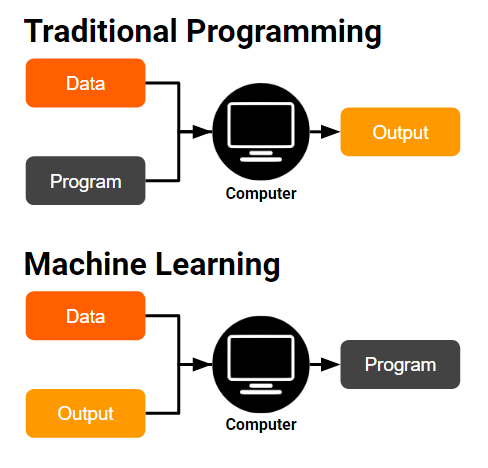
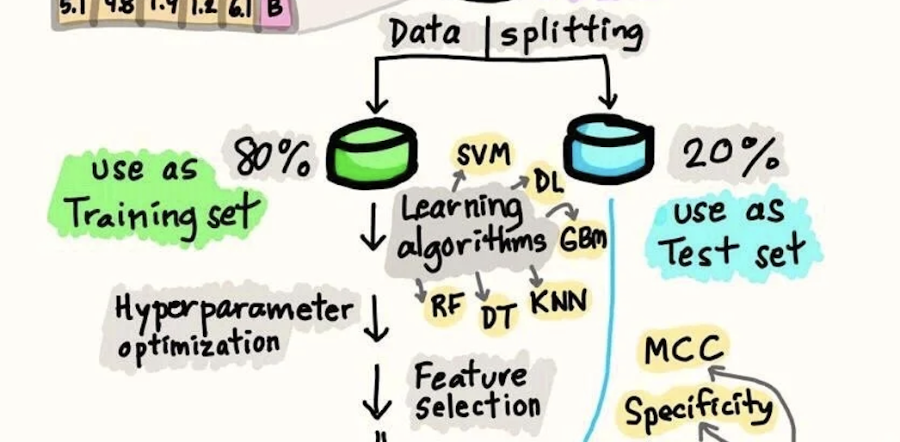

# 🤖 01-Artificial Ingelligence 
## ผศ. ดร. ชนันท์กรณ์ จันแดง
### สำนักวิชาสารสนเทศศาสตร์ มหาวิทยาลัยวลัยลักษณ์

---

## 1. ปัญญาประดิษฐ์ (Artificial Intelligence)

**AI คืออะไร?**  
คือการทำให้ “คอมพิวเตอร์” สามารถทำสิ่งที่โดยปกติ **ต้องใช้สติปัญญาของมนุษย์**

เช่น  
- การเรียนรู้ (Learning)  
- การให้เหตุผล (Reasoning)  
- การแก้ปัญหา (Problem Solving)  
- การเข้าใจภาษา (Language)

---

### 🔹 ตัวอย่างในชีวิตจริง

- รถยนต์ไร้คนขับ 🚗  
- Chatbot และผู้ช่วยเสมือน เช่น Siri  
- ระบบแนะนำสินค้าใน Shopee หรือ Netflix  

---

### 🔹 สรุปสั้น

> AI คือการทำให้เครื่องจักร “คิดและเรียนรู้ได้” เหมือนมนุษย์  
> เป็นรากฐานของเทคโนโลยีสมัยใหม่ทุกวันนี้

---

## 2. Machine Learning (ML)

**Machine Learning คืออะไร?**  
การทำให้คอมพิวเตอร์ “เรียนรู้จากข้อมูล” โดยไม่ต้องสั่งทุกขั้นตอน

---

### 🔹 ตัวอย่างที่เข้าใจง่าย

- ฝึกให้คอมพิวเตอร์จำแนก “อีเมลขยะ”  
- สอนระบบให้แนะนำหนังที่เราชอบบน Netflix  
- ใช้ข้อมูลเก่าเพื่อ “ทำนายยอดขายในอนาคต”

---

### 🔹 ประเภทของ Machine Learning

1. **Supervised Learning** – มีคำตอบกำกับ (มี label)  
2. **Unsupervised Learning** – ไม่มีคำตอบ ให้ค้นหารูปแบบเอง  
3. **Reinforcement Learning** – เรียนรู้จากรางวัล/บทลงโทษ  

---

### 🔹 สรุปสั้น

> ML คือสะพานเชื่อมระหว่าง “แนวคิดของ AI”  
> กับ “การใช้งานจริงในชีวิตประจำวัน”

---

---
## Machine Learning Process
### 1. Initial Dataset

เป็นจุดเริ่มต้นของข้อมูลดิบ (Raw Data) ที่รวบรวมมาจากหลายแหล่ง เช่น ไฟล์ CSV, ฐานข้อมูล, หรือเซนเซอร์ ข้อมูลนี้ยังไม่พร้อมใช้กับโมเดล ML เพราะอาจมีความซ้ำซ้อน ผิดพลาด หรือไม่สมบูรณ์

---
### 2. Exploratory Data Analysis (EDA)

ขั้นตอนการสำรวจข้อมูลเพื่อทำความเข้าใจโครงสร้างและคุณภาพ เช่น

* การดูการกระจายของตัวแปร
* การตรวจสอบ outlier
* การใช้เทคนิค **PCA (Principal Component Analysis)** เพื่อลดมิติ
* การใช้ **SOM (Self-Organizing Map)** เพื่อหา pattern

---
### 3. Data Cleaning / Pre-processing

การทำความสะอาดและปรับข้อมูลให้เหมาะสม เช่น

* ลบค่าที่ขาดหายไป
* แปลง categorical เป็นตัวเลข
* ลบฟีเจอร์ที่ซ้ำซ้อน

---
### 4. Data Splitting

แบ่งข้อมูลออกเป็น 2 ส่วนหลัก:

* **Training Set (80%)** → ใช้สำหรับฝึกโมเดล
* **Test Set (20%)** → ใช้สำหรับประเมินผลลัพธ์

---
### 5. Learning Algorithms

เลือกโมเดลที่เหมาะสม เช่น **SVM (Support Vector Machine)**
**DL (Deep Learning)**  **GBM (Gradient Boosting Machine)** **RF (Random Forest)** **kNN (k-Nearest Neighbors)**

---
### 6. Hyperparameter Optimization

ปรับค่าพารามิเตอร์สำคัญของโมเดล เช่น ค่า k ของ kNN, จำนวน tree ของ Random Forest เพื่อเพิ่มประสิทธิภาพการทำนาย

---
### 7. Feature Selection

เลือกเฉพาะคุณลักษณะที่สำคัญที่สุด เพื่อให้โมเดลเรียนรู้ได้เร็วขึ้นและลด Overfitting

---
### 8. Cross-Validation & Training Model

* ใช้ **Cross-Validation** เพื่อตรวจสอบความเสถียรของโมเดล
* ฝึก (train) โมเดลบน training set และได้ **Trained Model**

---
### 9. Evaluate Model Performance

วัดผลการทำงานด้วย metric ที่เหมาะสม เช่น

* **Classification:** Accuracy, Precision, Recall, F1-score, MCC
* **Regression:** RMSE, MSE, ($R^2$)

---
### 10. Predicted Values

นำโมเดลที่ผ่านการประเมินแล้วไปทำนายค่าของข้อมูลใหม่

---
 
## 3. Deep Learning (DL)

**Deep Learning คืออะไร?**  
คือการใช้ **โครงข่ายประสาทเทียม (Neural Networks)**  
ที่เลียนแบบการทำงานของสมองมนุษย์

---

### 🔹 ตัวอย่างที่เห็นบ่อย

- การจำภาพแมว 🐱 หรือสุนัข 🐶  
- การรู้จำเสียงพูด (Siri, Google Voice)  
- การทำนายราคาหุ้น 📈  

---

### 🔹 ข้อจำกัดของ Deep Learning

- ทำได้ดีเฉพาะ “งานที่ฝึกมา”  
- ไม่เข้าใจ “ความหมายของภาษา” จริง ๆ  
- ต้องใช้ข้อมูลจำนวนมาก  

---

### 🔹 Key Takeaway

> Deep Learning คือรากฐานของ AI  
> แต่ยัง “เข้าใจภาษา” ได้ไม่ดีพอ  
> จึงต้องพัฒนาไปสู่ **LLM**

---

## 4. การทำงานของ Language Model

### 🔹 หลักการพื้นฐาน

LLM เรียนรู้ **ความน่าจะเป็นของลำดับคำ**  
เพื่อ “ทำนายคำถัดไป” ในประโยค

**ตัวอย่าง:**  
> “ฉันกำลังเขียน ___”  
> → “บทความ”, “โปรแกรม”, “จดหมาย”

---

### 🔹 การแปลงข้อความเป็นตัวเลข

1. **Tokenization:** แบ่งคำเป็นชิ้นเล็ก ๆ  
   - “สวัสดีครับ” → ["สวั", "สดี", "ครับ"]  

2. **Embeddings:** แปลงแต่ละ token เป็นเวกเตอร์ตัวเลข  
   - ทำให้โมเดล “เข้าใจความหมาย” ของคำได้  

---

## 5. Large Language Model (LLM)

**LLM คืออะไร?**  
โมเดล AI ที่ “เข้าใจและสร้างภาษาได้”  
โดยใช้สถาปัตยกรรม **Transformer**

---

### 🔹 ตัวอย่าง LLM ที่เรารู้จัก

- **ChatGPT** 🧠  
- **Google Bard (Gemini)** 🌐  
- **Claude (Anthropic)**  
- **LLaMA (Meta)**  

---

### 🔹 ความสามารถหลักของ LLM

- เขียนและสรุปข้อความ ✍️  
- แปลภาษา 🌏  
- ตอบคำถาม 🗣️  
- สร้างโค้ด 💻  

---

### 🔹 Key Point สำหรับนักเรียน ม.ปลาย

- LLM “อ่าน-เขียน-เข้าใจ” ภาษาเหมือนมนุษย์  
- ใช้ “Prompt” บอกสิ่งที่ต้องการ  
- ยืดหยุ่น ใช้ได้หลายงาน โดยไม่ต้องสร้างใหม่  

---

## 6. LLM ต่างจาก Deep Learning Model อย่างไร

| ประเด็น | Deep Learning ทั่วไป | LLM |
|----------|--------------------|-----|
| **ข้อมูลฝึก** | ใช้ข้อมูลเฉพาะงาน | ใช้ข้อความมหาศาลหลายหัวข้อ |
| **วัตถุประสงค์** | งานเฉพาะ เช่น จำภาพ | งานด้านภาษาแบบทั่วไป |
| **การเรียนรู้** | เรียนรู้จากตัวอย่างแคบ ๆ | เข้าใจโครงสร้างและบริบทของภาษา |
| **ความยืดหยุ่น** | ต้องฝึกใหม่ถ้าเปลี่ยนงาน | ใช้ Prompt ได้หลายแบบ |
| **ตัวอย่างโมเดล** | ResNet, RNN, LSTM | GPT, LLaMA, PaLM |

---

## 🎯 สรุปสุดท้าย

- AI → แนวคิดกว้าง “ให้เครื่องคิดได้”  
- ML → ให้เครื่อง “เรียนรู้จากข้อมูล”  
- DL → ใช้สมองจำลองเพื่อเรียนรู้ลึกขึ้น  
- LLM → เข้าใจภาษาและสร้างประโยคใหม่ได้  

✨ นี่คือเหตุผลที่ ChatGPT สามารถ “สนทนา” กับเราได้เหมือนมนุษย์ ✨
