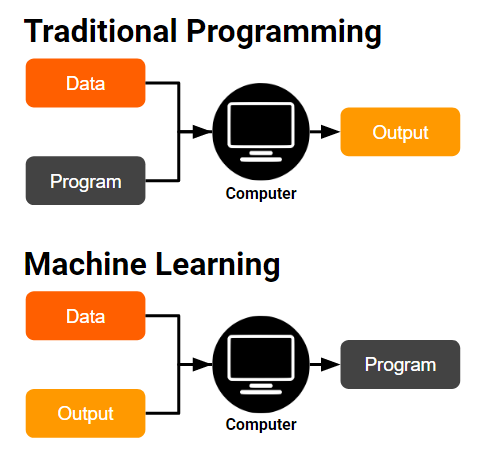
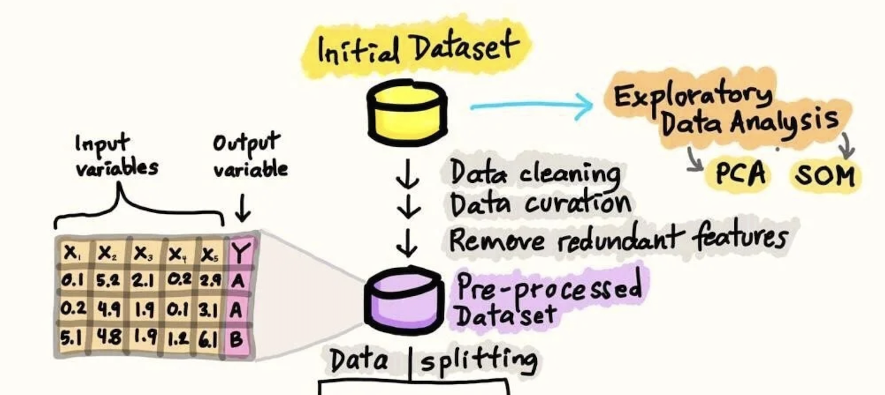
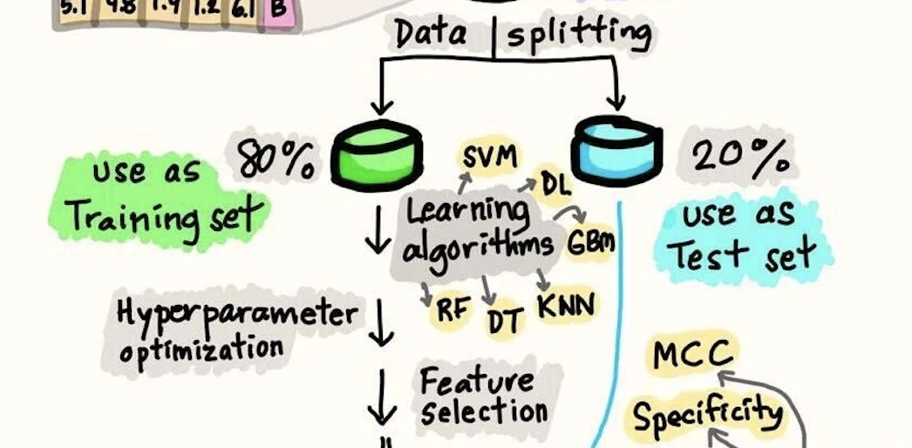
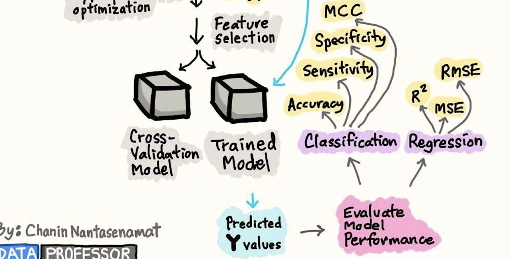

# From Text to AI Assistant Using Machine Learning and RAG Framework
## การประมวลผลข้อความสู่การสร้างผู้ช่วยอัจฉริยะโดยอาศัยการเรียนรู้ของเครื่องและกรอบแนวคิด RAG
### 4-6 ตุลาคม 2568
### สำนักวิชาสารสนเทศศาสตร์ มหาวิทยาลัยวลัยลักษณ์

---
# 🤖 01-Artificial Ingelligence 
## ผศ. ดร. ชนันท์กรณ์ จันแดง
### สำนักวิชาสารสนเทศศาสตร์ มหาวิทยาลัยวลัยลักษณ์

---

## 1. ปัญญาประดิษฐ์ (Artificial Intelligence)

**AI คืออะไร?**  
คือการทำให้ “คอมพิวเตอร์” สามารถทำสิ่งที่โดยปกติ **ต้องใช้สติปัญญาของมนุษย์**

เช่น  
- การเรียนรู้ (Learning)  
- การให้เหตุผล (Reasoning)  
- การแก้ปัญหา (Problem Solving)  
- การเข้าใจภาษา (Language)

---

### 🔹 ตัวอย่างในชีวิตจริง

- รถยนต์ไร้คนขับ 🚗  
- Chatbot และผู้ช่วยเสมือน เช่น Siri  
- ระบบแนะนำสินค้าใน Shopee หรือ Netflix  

---

### 🔹 สรุปสั้น

> AI คือการทำให้เครื่องจักร “คิดและเรียนรู้ได้” เหมือนมนุษย์  
> เป็นรากฐานของเทคโนโลยีสมัยใหม่ทุกวันนี้

---

## 2. Machine Learning (ML)

**Machine Learning คืออะไร?**  
การทำให้คอมพิวเตอร์ “เรียนรู้จากข้อมูล” โดยไม่ต้องสั่งทุกขั้นตอน

---

### 🔹 ตัวอย่างที่เข้าใจง่าย

- ฝึกให้คอมพิวเตอร์จำแนก “อีเมลขยะ”  
- สอนระบบให้แนะนำหนังที่เราชอบบน Netflix  
- ใช้ข้อมูลเก่าเพื่อ “ทำนายยอดขายในอนาคต”

---

### 🔹 ประเภทของ Machine Learning

1. **Supervised Learning** – มีคำตอบกำกับ (มี label)  
2. **Unsupervised Learning** – ไม่มีคำตอบ ให้ค้นหารูปแบบเอง  
3. **Reinforcement Learning** – เรียนรู้จากรางวัล/บทลงโทษ  

---

### 🔹 สรุปสั้น

> ML คือสะพานเชื่อมระหว่าง “แนวคิดของ AI”  
> กับ “การใช้งานจริงในชีวิตประจำวัน”

---


---
## Machine Learning Process
### 1. Initial Dataset

เป็นจุดเริ่มต้นของข้อมูลดิบ (Raw Data) ที่รวบรวมมาจากหลายแหล่ง เช่น ไฟล์ CSV, ฐานข้อมูล, หรือเซนเซอร์ ข้อมูลนี้ยังไม่พร้อมใช้กับโมเดล ML เพราะอาจมีความซ้ำซ้อน ผิดพลาด หรือไม่สมบูรณ์


---
### 2. Exploratory Data Analysis (EDA)

ขั้นตอนการสำรวจข้อมูลเพื่อทำความเข้าใจโครงสร้างและคุณภาพ เช่น

* การดูการกระจายของตัวแปร
* การตรวจสอบ outlier
* การใช้เทคนิค **PCA (Principal Component Analysis)** เพื่อลดมิติ
* การใช้ **SOM (Self-Organizing Map)** เพื่อหา pattern


---
### 3. Data Cleaning / Pre-processing

การทำความสะอาดและปรับข้อมูลให้เหมาะสม เช่น

* ลบค่าที่ขาดหายไป
* แปลง categorical เป็นตัวเลข
* ลบฟีเจอร์ที่ซ้ำซ้อน


---
### 4. Data Splitting

แบ่งข้อมูลออกเป็น 2 ส่วนหลัก:

* **Training Set (80%)** → ใช้สำหรับฝึกโมเดล
* **Test Set (20%)** → ใช้สำหรับประเมินผลลัพธ์


---
### 5. Learning Algorithms

เลือกโมเดลที่เหมาะสม เช่น **SVM (Support Vector Machine)**
**DL (Deep Learning)**  **GBM (Gradient Boosting Machine)** **RF (Random Forest)** **kNN (k-Nearest Neighbors)**


---
### 6. Hyperparameter Optimization

ปรับค่าพารามิเตอร์สำคัญของโมเดล เช่น ค่า k ของ kNN, จำนวน tree ของ Random Forest เพื่อเพิ่มประสิทธิภาพการทำนาย


---
### 7. Feature Selection

เลือกเฉพาะคุณลักษณะที่สำคัญที่สุด เพื่อให้โมเดลเรียนรู้ได้เร็วขึ้นและลด Overfitting


---
### 8. Cross-Validation & Training Model

* ใช้ **Cross-Validation** เพื่อตรวจสอบความเสถียรของโมเดล
* ฝึก (train) โมเดลบน training set และได้ **Trained Model**


---
### 9. Evaluate Model Performance

วัดผลการทำงานด้วย metric ที่เหมาะสม เช่น

* **Classification:** Accuracy, Precision, Recall, F1-score, MCC
* **Regression:** RMSE, MSE, ($R^2$)


---
### 10. Predicted Values

นำโมเดลที่ผ่านการประเมินแล้วไปทำนายค่าของข้อมูลใหม่

---
 
## 3. Deep Learning (DL)

**Deep Learning คืออะไร?**  
คือการใช้ **โครงข่ายประสาทเทียม (Neural Networks)**  
ที่เลียนแบบการทำงานของสมองมนุษย์

---

### 🔹 ตัวอย่างที่เห็นบ่อย

- การจำภาพแมว 🐱 หรือสุนัข 🐶  
- การรู้จำเสียงพูด (Siri, Google Voice)  
- การทำนายราคาหุ้น 📈  

---

### 🔹 ข้อจำกัดของ Deep Learning

- ทำได้ดีเฉพาะ “งานที่ฝึกมา”  
- ไม่เข้าใจ “ความหมายของภาษา” จริง ๆ  
- ต้องใช้ข้อมูลจำนวนมาก  

---

### 🔹 Key Takeaway

> Deep Learning คือรากฐานของ AI  
> แต่ยัง “เข้าใจภาษา” ได้ไม่ดีพอ  
> จึงต้องพัฒนาไปสู่ **LLM**

---

## 4. การทำงานของ Language Model

### 🔹 หลักการพื้นฐาน

LLM เรียนรู้ **ความน่าจะเป็นของลำดับคำ**  
เพื่อ “ทำนายคำถัดไป” ในประโยค

**ตัวอย่าง:**  
> “ฉันกำลังเขียน ___”  
> → “บทความ”, “โปรแกรม”, “จดหมาย”

---

### 🔹 การแปลงข้อความเป็นตัวเลข

1. **Tokenization:** แบ่งคำเป็นชิ้นเล็ก ๆ  
   - “สวัสดีครับ” → ["สวั", "สดี", "ครับ"]  

2. **Embeddings:** แปลงแต่ละ token เป็นเวกเตอร์ตัวเลข  
   - ทำให้โมเดล “เข้าใจความหมาย” ของคำได้  

---

## 5. Large Language Model (LLM)

**LLM คืออะไร?**  
โมเดล AI ที่ “เข้าใจและสร้างภาษาได้”  
โดยใช้สถาปัตยกรรม **Transformer**

---

### 🔹 ตัวอย่าง LLM ที่เรารู้จัก

- **ChatGPT** 🧠  
- **Google Bard (Gemini)** 🌐  
- **Claude (Anthropic)**  
- **LLaMA (Meta)**  

---

### 🔹 ความสามารถหลักของ LLM

- เขียนและสรุปข้อความ ✍️  
- แปลภาษา 🌏  
- ตอบคำถาม 🗣️  
- สร้างโค้ด 💻  

---

### 🔹 Key Point สำหรับนักเรียน ม.ปลาย

- LLM “อ่าน-เขียน-เข้าใจ” ภาษาเหมือนมนุษย์  
- ใช้ “Prompt” บอกสิ่งที่ต้องการ  
- ยืดหยุ่น ใช้ได้หลายงาน โดยไม่ต้องสร้างใหม่  

---

## 6. LLM ต่างจาก Deep Learning Model อย่างไร

| ประเด็น | Deep Learning ทั่วไป | LLM |
|----------|--------------------|-----|
| **ข้อมูลฝึก** | ใช้ข้อมูลเฉพาะงาน | ใช้ข้อความมหาศาลหลายหัวข้อ |
| **วัตถุประสงค์** | งานเฉพาะ เช่น จำภาพ | งานด้านภาษาแบบทั่วไป |
| **การเรียนรู้** | เรียนรู้จากตัวอย่างแคบ ๆ | เข้าใจโครงสร้างและบริบทของภาษา |
| **ความยืดหยุ่น** | ต้องฝึกใหม่ถ้าเปลี่ยนงาน | ใช้ Prompt ได้หลายแบบ |
| **ตัวอย่างโมเดล** | ResNet, RNN, LSTM | GPT, LLaMA, PaLM |

---

## 🎯 สรุปสุดท้าย

- AI → แนวคิดกว้าง “ให้เครื่องคิดได้”  
- ML → ให้เครื่อง “เรียนรู้จากข้อมูล”  
- DL → ใช้สมองจำลองเพื่อเรียนรู้ลึกขึ้น  
- LLM → เข้าใจภาษาและสร้างประโยคใหม่ได้  

✨ นี่คือเหตุผลที่ ChatGPT สามารถ “สนทนา” กับเราได้เหมือนมนุษย์ ✨

---

# 🧠 02 - การวิเคราะห์ข้อความเชิงสถิติ  
### (Statistical Text Analysis)

**Chanankorn**  
*School of Informatics, Walailak University*  

---

## 🔍 บทนำเชิงทฤษฎี

การวิเคราะห์ข้อความเชิงสถิติเป็นกระบวนการทาง  **Data Science** และ **Computational Linguistics**  ที่นำหลักการทาง **คณิตศาสตร์และสถิติ**  มาประยุกต์กับ **ข้อมูลข้อความ (Text Data)**

🎯 เป้าหมายหลัก:
- แปลงข้อความให้อยู่ในรูปเชิงปริมาณ
- เพื่อการจำแนกประเภท, วิเคราะห์หัวข้อ, วิเคราะห์อารมณ์ ฯลฯ

---

## 1️⃣ Text Preprocessing  
### (การเตรียมข้อมูลข้อความ)

เป็นขั้นตอนพื้นฐานที่สำคัญที่สุด  
เพื่อจัดการ **Noise** เช่น คำฟุ่มเฟือยหรือเครื่องหมายวรรคตอน

---

### 🔹 ขั้นตอนหลักของ Text Preprocessing

1. **Tokenization** – ตัดคำ  
2. **Stopword Removal** – ลบคำที่ไม่สำคัญ  
3. **Stemming / Lemmatization** – แปลงคำให้อยู่ในรูปมาตรฐาน  
4. **Symbol & Number Removal** – ลบตัวเลขและสัญลักษณ์ที่ไม่จำเป็น  

---

### ✂️ Tokenization – การตัดข้อความเป็นคำ

| ตัวอย่าง | ผลลัพธ์หลัง Tokenization |
| -------- | -------------------------- |
| “Data scientists are analyzing large amounts of data in 2024!” | `['Data', 'scientists', 'are', 'analyzing', 'large', ...]` |

📘 แยกข้อความเป็นคำหรือวลี เพื่อให้นำไปวิเคราะห์เชิงสถิติได้

---

### 🚫 Stopword Removal – ลบคำที่ไม่สำคัญ

ลบคำทั่วไป เช่น “the”, “of”, “in”  

| ตัวอย่าง | ผลลัพธ์ |
| -------- | -------- |
| “Data scientists are analyzing large amounts of data in 2024!” | `['Data', 'scientists', 'analyzing', 'large', 'data']` |

---

### 🔤 Lemmatization – ทำให้คำอยู่ในรูปมาตรฐาน

รวมคำที่มีรากเดียวกัน เช่น  
“analyzing” → “analyze”, “models” → “model”

---

### 🔣 Symbol & Number Removal

ลบตัวเลข เครื่องหมาย และสัญลักษณ์ที่ไม่จำเป็น  

📍 “AI model perform exceptionally well experiment”

---

### 🧩 สรุปภาพรวมการเตรียมข้อมูล

| ขั้นตอน | วัตถุประสงค์ | ผลลัพธ์ |
| -------- | ------------- | -------- |
| Tokenization | แยกคำ | รายการคำ |
| Stopword Removal | ลบคำทั่วไป | ลด Noise |
| Lemmatization | รวมรูปคำ | คำมาตรฐาน |
| Symbol Removal | ลบตัวเลข/สัญลักษณ์ | ข้อความสะอาด |

---

### 💻 ตัวอย่างโค้ด Python

```python
import nltk
from nltk.corpus import stopwords
from nltk.tokenize import word_tokenize
from nltk.stem import WordNetLemmatizer
import string

nltk.download('punkt')
nltk.download('stopwords')
nltk.download('wordnet')

text = "Statistical text analysis involves processing text data."

tokens = word_tokenize(text.lower())
filtered = [w for w in tokens if w not in stopwords.words('english') and w not in string.punctuation]
lemmatizer = WordNetLemmatizer()
lemmatized = [lemmatizer.lemmatize(word) for word in filtered]

print("After Cleaning:", lemmatized)
````

---

## 2️⃣ Statistical Representation

### (การแทนค่าข้อความเชิงสถิติ)

หลังจากเตรียมข้อมูลแล้ว → ต้องแทนค่าข้อความเป็นเชิงตัวเลข
เพื่อให้วิเคราะห์ทางสถิติได้

---

### 🔹 Bag of Words (BoW)

**แนวคิด:**
นับจำนวนคำที่ปรากฏในแต่ละเอกสารโดยไม่สนใจลำดับคำ

📊 เช่น
“data scientist analyze large amount data” → `[data:2, scientist:1, ...]`

✅ เข้าใจง่าย
⚠️ ไม่สนใจบริบทของคำ

---

### 🔹 TF–IDF (Term Frequency – Inverse Document Frequency)

**แนวคิด:**
ให้ค่าน้ำหนักกับคำที่ปรากฏเฉพาะในบางเอกสาร

🧮 สูตร:
$TF-IDF(t, d) = TF(t, d) × log(N / n_t)$

ช่วยให้คำสำคัญโดดเด่นขึ้น เช่น

* “experiment” → ค่าสูง
* “data” → ค่าต่ำ

---

### 🔹 N-grams

**แนวคิด:**
พิจารณาคำต่อเนื่องกัน (sequence of words)

* Unigram → “machine”
* Bigram → “machine learning”
* Trigram → “machine learning helps”

ช่วยให้จับความหมายและบริบทได้ดีกว่า BoW

---

### 🧩 สรุปเปรียบเทียบเทคนิคการแทนข้อความ

| เทคนิค  | หลักการ             | ข้อดี       | ข้อจำกัด       |
| ------- | ------------------- | ----------- | -------------- |
| BoW     | นับคำ               | เข้าใจง่าย  | ไม่รู้ลำดับคำ  |
| TF–IDF  | น้ำหนักตามความสำคัญ | เน้นคำสำคัญ | ไม่รู้บริบท    |
| N-grams | พิจารณาลำดับคำ      | เข้าใจบริบท | ข้อมูลขยายใหญ่ |

---

## 3️⃣ Descriptive Statistics

### (การวิเคราะห์เชิงพรรณนา)

ใช้เพื่ออธิบายลักษณะของข้อมูลข้อความ เช่น

* นับคำที่พบบ่อย
* สร้าง **Word Cloud**

---

### 💻 ตัวอย่างโค้ด

```python
from collections import Counter
from wordcloud import WordCloud
import matplotlib.pyplot as plt

words = ["data", "text", "analysis", "data", "machine", "learning"]
freq = Counter(words)
print(freq.most_common(5))

wc = WordCloud(width=800, height=400, background_color='white').generate(" ".join(words))
plt.imshow(wc, interpolation='bilinear')
plt.axis("off")
plt.show()
```

---

## 4️⃣ Inferential & Predictive Analysis

### 🔹 Topic Modeling (LDA)

แยกข้อความออกเป็นหัวข้อโดยอัตโนมัติ

```python
from sklearn.decomposition import LatentDirichletAllocation
from sklearn.feature_extraction.text import CountVectorizer

docs = ["Machine learning improves analytics.", "Deep learning in AI."]
X = CountVectorizer().fit_transform(docs)
lda = LatentDirichletAllocation(n_components=2).fit(X)
```

---

### 🔹 Sentiment Analysis

วิเคราะห์อารมณ์ข้อความ เช่น บวก / กลาง / ลบ

```python
from textblob import TextBlob
texts = ["I love this product!", "Worst experience ever."]
for t in texts:
    print(t, TextBlob(t).sentiment.polarity)
```

---

### 🔹 Clustering / Classification

ใช้ K-means หรือ Naïve Bayes
เพื่อจัดกลุ่มข้อความโดยอัตโนมัติ

```python
from sklearn.cluster import KMeans
from sklearn.feature_extraction.text import TfidfVectorizer
texts = ["AI and ML", "Statistical data science"]
X = TfidfVectorizer().fit_transform(texts)
KMeans(n_clusters=2).fit(X)
```

---

## 5️⃣ แนวคิดเชิงทฤษฎีที่เกี่ยวข้อง

| สาขาวิชา                              | คำอธิบาย                           |
| ------------------------------------- | ---------------------------------- |
| **Corpus Linguistics**                | ศึกษาภาษาโดยใช้คลังข้อมูลขนาดใหญ่  |
| **Information Retrieval (IR)**        | การค้นหาและดึงข้อความที่เกี่ยวข้อง |
| **Natural Language Processing (NLP)** | การประมวลผลและเข้าใจภาษามนุษย์     |

---

## 6️⃣ ตัวอย่างการประยุกต์

| การประยุกต์                | คำอธิบาย                    |
| -------------------------- | --------------------------- |
| วิเคราะห์โพสต์สังคมออนไลน์ | ตรวจจับอารมณ์ของผู้ใช้      |
| วิเคราะห์ข่าวเศรษฐกิจ      | หาหัวข้อแนวโน้มจากบทความ    |
| วิเคราะห์รีวิวสินค้า       | ตรวจสอบความพึงพอใจของลูกค้า |
| วิเคราะห์บทความวิชาการ     | ดึงคำสำคัญด้วย TF-IDF       |

---

## 7️⃣ กรณีศึกษา: การตรวจจับ Spam

การจำแนกข้อความว่าเป็น **Spam / Ham**
โดยใช้เทคนิค TF–IDF และ Naïve Bayes

---

### 💻 ตัวอย่างโค้ดย่อ

```python
from sklearn.naive_bayes import MultinomialNB
from sklearn.model_selection import train_test_split
from sklearn.feature_extraction.text import TfidfVectorizer

X_train, X_test, y_train, y_test = train_test_split(texts, labels)
tfidf = TfidfVectorizer()
X_train_tfidf = tfidf.fit_transform(X_train)

model = MultinomialNB().fit(X_train_tfidf, y_train)
```

---

### 🔎 สรุปขั้นตอนของ Spam Detection

| ขั้นตอน        | รายละเอียด                 |
| -------------- | -------------------------- |
| โหลดข้อมูล     | Spam / Ham messages        |
| Preprocessing  | ลบ stopwords, lowercase    |
| TF–IDF         | แปลงข้อความเป็นตัวเลข      |
| Classification | Naïve Bayes                |
| Evaluation     | Accuracy, Confusion Matrix |

---

## 🧠 การขยายเชิงวิชาการ

* ทดลองโมเดลอื่น: Logistic Regression, SVM, Random Forest
* ใช้ **N-grams** เพื่อเพิ่มบริบท
* วิเคราะห์ **Feature Importance**
* ใช้ชุดข้อมูลจริง เช่น *Kaggle SMS Spam Dataset*

---

# 📘 สรุป

* Text Analysis คือการเปลี่ยนข้อความเป็นข้อมูลเชิงตัวเลข
* ใช้สถิติและ Machine Learning เพื่อเข้าใจเนื้อหา
* มีการประยุกต์ใช้กว้างขวางใน Data Science และ NLP

---

# 📖 03 - Contextual Text Analysis
## ผศ. ดร. ชนันท์กรณ์ จันแดง
### สำนักวิชาสารสนเทศศาสตร์ มหาวิทยาลัยวลัยลักษณ์
---

# 🧭 บทนำ: การวิเคราะห์ข้อความเชิงบริบท

**แนวคิดหลัก:**  
เข้าใจ "ความหมายของข้อความ" โดยคำนึงถึงบริบท (Context)

> คำว่า “bank” อาจหมายถึง “ธนาคาร” หรือ “ริมฝั่งน้ำ”  
> บริบทจึงมีความสำคัญต่อการตีความ

---

# ⚙️ Text Embedding คืออะไร

**Text Embedding**: การแปลงข้อความให้อยู่ในรูปเวกเตอร์มิติสูง  
ข้อความที่มีความหมายคล้ายกัน → เวกเตอร์อยู่ใกล้กัน

- Cosine Similarity → วัดมุมระหว่างเวกเตอร์  
- Euclidean Distance → วัดระยะทางระหว่างเวกเตอร์

> “ครู” ใกล้กับ “อาจารย์” และ “ผู้สอน”

---

# 🧩 ทฤษฎีพื้นฐานทางวิชาการ

## Distributional Semantics Theory
> “You shall know a word by the company it keeps.”  
(Firth, 1957)

- คำที่อยู่ในบริบทเดียวกันมักมีความหมายคล้ายกัน
- เป็นรากฐานของแนวคิดการเรียนรู้เชิงการกระจาย

---

## Vector Space Model (VSM)

- การแทนข้อความในรูปเวกเตอร์  
- วัดความคล้ายคลึงด้วย cosine / distance  
- เป็นจุดเริ่มต้นของแนวคิด Embedding

---

## Word Embedding Models

| โมเดล | แนวคิด | จุดเด่น |
|-------|--------|---------|
| **Word2Vec** | เรียนรู้คำจากบริบท | เข้าใจความสัมพันธ์เชิงความหมาย |
| **GloVe** | ใช้ Co-occurrence Statistics | เน้น global context |
| **FastText** | ใช้ subword | รองรับคำใหม่ (OOV words) |

---

## Contextual Embeddings

- ใช้ Deep Neural Networks (LSTM / Transformer)  
- คำเดียวกันมีเวกเตอร์ต่างกันในบริบทต่างกัน

| โมเดล | ลักษณะ | จุดเด่น |
|-------|---------|---------|
| ELMo | Bi-LSTM | บริบทสองทิศทาง |
| BERT | Transformer สองทิศทาง | เข้าใจจากซ้าย-ขวา |
| GPT | Transformer เดียว | สร้างข้อความต่อเนื่อง |
| SBERT | ปรับ BERT เพื่อเปรียบเทียบประโยค | ใช้ใน Semantic Search |

---

# 🔬 แนวคิดทฤษฎีขั้นสูง

## Manifold Hypothesis
- ข้อความมีโครงสร้างซับซ้อนในมิติสูง  
- Embedding คือการเรียนรู้โครงสร้างภายใน (semantic manifold)

## Transfer Learning
- ใช้ embedding ที่ฝึกมาก่อน เช่น BERT, GloVe  
- นำไปใช้ fine-tuning ในงานใหม่ (เช่น Sentiment Analysis)

## Explainability
- พยายามตีความแกนของเวกเตอร์ เช่น เพศ, อารมณ์

---

# 💼 การประยุกต์ใช้ Text Embedding

| การประยุกต์ | คำอธิบาย |
|--------------|----------|
| Semantic Search | ค้นหาตามความหมายแทนการค้นหาคำตรงตัว |
| Clustering | จัดกลุ่มข้อความใกล้เคียง |
| Recommendation | แนะนำเนื้อหาคล้ายกัน |
| Similarity Measurement | ตรวจจับการลอกงาน / ความเหมือนของประโยค |
| LLM Understanding | ใช้ใน GPT, BERT, Claude ฯลฯ |

---

# 🧠 สรุปเชิงทฤษฎี

1. Embedding = สะพานระหว่างภาษาและคณิตศาสตร์  
2. Contextual Embedding = วิวัฒนาการขั้นสูงของ NLP  
3. เป็นรากฐานของระบบ Search, Chatbot, และ LLMs

---

# 🧪 Workshop: Text Embedding

**วัตถุประสงค์**  
- เข้าใจการแปลงข้อความเป็นเวกเตอร์  
- วัดความคล้ายคลึงเชิงความหมาย  
- เปรียบเทียบ Keyword vs Contextual Approach

---

## 🔧 เครื่องมือและข้อมูล

- Python / Google Colab  
- Libraries: `sentence-transformers`, `numpy`, `sklearn`

```python
texts = [
 "รถยนต์ไฟฟ้าเป็นมิตรต่อสิ่งแวดล้อม",
 "ยานยนต์พลังงานสะอาดกำลังได้รับความนิยม",
 "ธนาคารให้บริการสินเชื่อบ้าน",
 "แม่น้ำมีน้ำมากในฤดูฝน"
]
```

---

## 🧠 สร้าง Sentence Embeddings

```python
from sentence_transformers import SentenceTransformer
model = SentenceTransformer('paraphrase-multilingual-MiniLM-L12-v2')
embeddings = model.encode(texts)
```

- ข้อความ → เวกเตอร์มิติ 384  
- ความหมายใกล้กัน → เวกเตอร์อยู่ใกล้กัน

---

## 📏 Semantic Similarity

```python
from sentence_transformers import util
similarity = util.cos_sim(embeddings, embeddings)
```

| ค่า | การตีความ |
|------|-------------|
| 0.8–1.0 | คล้ายกันมาก |
| 0.5–0.8 | ค่อนข้างคล้าย |
| <0.2 | ต่างกันมาก |

---

# 📊 Visualization

```python
from sklearn.manifold import TSNE
plt.scatter(...)
```

- จุดใกล้กัน → ข้อความคล้ายกัน  
- แสดง semantic clusters

---

# 🧪 Showcase: Spam Detection

**แนวคิด:**  
แยกข้อความเป็น 2 กลุ่ม — Spam vs Ham  
ใช้ Contextual Embedding + KNN Classifier

```python
data = {...}
model = SentenceTransformer('all-MiniLM-L6-v2')
embeddings = model.encode(data['text'])
```

---

## 🔍 ตัวอย่างผลลัพธ์

| ข้อความ | ผลลัพธ์ |
|-----------|----------|
| “Get rich quick!” | spam |
| “Review project report.” | ham |

**Embedding เข้าใจเจตนา (intent)** แม้ไม่มี keyword “spam”

---

# 🧠 Key Insights

- Context สำคัญกว่าคำเดี่ยว  
- Embedding ช่วยให้คอมพิวเตอร์เข้าใจ “ความหมาย”  
- ใช้ได้ทั้งในงาน Search, Chatbot, และ AI Model  
- เป็นรากฐานของ LLM ทุกชนิด

---

# 🤖 Workshop:  
**04-สร้าง AI ตอบคำถามจากเอกสาร (Document Q&A)**  
ด้วยแนวคิด **RAG Framework**

👨‍🏫 ผู้สอน: ดร. CJ  
Walailak University  

---

# 🎯 เป้าหมายของ Workshop

- เข้าใจว่า **AI อ่านและเข้าใจเอกสารได้อย่างไร**  
- รู้จักแนวคิด **RAG – Retrieval Augmented Generation**  
- ได้ลอง **สร้างระบบถาม-ตอบจากเอกสารจริง**  
- สร้าง **Chatbot ผู้ช่วยอ่านหนังสือ** ด้วยตัวเอง

---

# 🧠 ปัญหาที่เราพบ

> “อยากรู้ใจความสำคัญของบทความ แต่ไม่อยากอ่านทั้งหมด!”

AI สามารถช่วยเราได้โดย...

1. อ่านเอกสารแทนเรา  
2. ค้นหาส่วนสำคัญ  
3. ตอบคำถามจากข้อมูลจริง

---

# 🔍 แนวคิดของ RAG

**RAG = Retrieval + Augmented + Generation**

| ส่วน | หน้าที่ |
|------|----------|
| Retrieval | ค้นหาข้อมูลจากเอกสาร |
| Augmented | เสริมบริบทให้ AI เข้าใจเนื้อหา |
| Generation | สร้างคำตอบด้วยภาษาที่มนุษย์เข้าใจ |

---

# 💡 ตัวอย่างในชีวิตจริง

> ถ้าเราถามเพื่อนว่า  
> “บทที่ 3 วิทยาศาสตร์ พูดถึงอะไรนะ?”

เพื่อนจะไปเปิดหนังสือ  
→ อ่านบางย่อหน้า  
→ แล้วสรุปตอบให้เราเข้าใจง่าย

📘 นั่นแหละ! คือหลักการของ **RAG Framework**

---

# ⚙️ ขั้นตอนของระบบ RAG

1. 📄 **แบ่งเอกสารเป็นชิ้นเล็ก ๆ (Chunking)**  
2. 🧠 **ให้ AI สรุปแต่ละส่วน (Context)**  
3. 🔢 **แปลงข้อความเป็นตัวเลข (Embedding)**  
4. 🔍 **ค้นหาส่วนที่เกี่ยวข้อง (Retriever)**  
5. 💬 **สร้างคำตอบจากข้อมูลจริง (Generative Model)**  

---

# 🧩 ขั้นตอนที่ 1: Chunking

AI ไม่สามารถอ่านทั้งเล่มได้  
เราต้อง “หั่น” เอกสารให้เป็นส่วนย่อย ๆ

```python
text = "สมองของมนุษย์มีเซลล์ประสาทมากมาย..."
chunks = [text[i:i+50] for i in range(0, len(text), 50)]
print(chunks)
````

📘 *ทำให้ AI ย่อยข้อมูลได้ง่ายขึ้น*

---

# 🧠 ขั้นตอนที่ 2: สร้างบริบทด้วย LLM

ใช้ **ChatGPT / Llama 3 / Gemini**
ช่วย “สรุป” หรือ “อธิบาย” เนื้อหาแต่ละส่วน

```python
prompt = "สรุปข้อความนี้ให้นักเรียนเข้าใจง่าย:\n\n" + chunk
```

📘 *AI จะช่วยทำให้ข้อมูลเข้าใจง่ายขึ้น*

---

# 🔢 ขั้นตอนที่ 3: แปลงข้อความเป็นตัวเลข (Embedding)

AI เข้าใจ “ความหมาย” ผ่านตัวเลข
เรียกว่า **เวกเตอร์ (Vector)**

```python
from sentence_transformers import SentenceTransformer
model = SentenceTransformer('all-MiniLM-L6-v2')
vec = model.encode(["สมองของมนุษย์..."])
print(vec[:10])
```

🧩 “ตัวเลข” เหล่านี้แทนความหมายของข้อความ

---

# 💾 ขั้นตอนที่ 4: ค้นหาข้อมูลที่เกี่ยวข้อง (Retrieval)

```python
from sklearn.metrics.pairwise import cosine_similarity
score = cosine_similarity(query_vec, embeddings)
```

📘 *ค่าความใกล้เคียงมาก แปลว่าเนื้อหาเกี่ยวข้องกันมาก*

---

# 💬 ขั้นตอนที่ 5: ให้ AI สร้างคำตอบ

```python
prompt = f"ตอบคำถามนี้โดยอ้างอิงจากข้อมูล:\n{docs}\nคำถาม: {question}"
```

> AI จะสร้างคำตอบที่อิงจากข้อมูลจริง
> ไม่ได้ “เดา” จากความจำของโมเดล

---

# 🤖 เราได้ระบบ RAG แบบง่ายแล้ว!

🧩 สรุปขั้นตอนทั้งหมด

1️⃣ แบ่งเอกสารเป็นชิ้นเล็ก ๆ
2️⃣ ให้ AI สรุปหรือเสริมบริบท
3️⃣ แปลงข้อความเป็นเวกเตอร์
4️⃣ ค้นหาส่วนที่ใกล้เคียงกับคำถาม
5️⃣ ให้ AI สร้างคำตอบใหม่

---

# 🎮 Workshop Activity

### 🔹 ทดลองจริงใน Google Colab

1. เปิดไฟล์ `RAG_Workshop.ipynb`
2. คัดลอกโค้ดแต่ละขั้นตอน
3. พิมพ์คำถามเช่น

   * “มนุษย์คิดได้อย่างไร?”
   * “ระบบประสาทคืออะไร?”
4. ดูว่า AI ตอบอย่างไร

---

# 🧩 Workshop Challenge

> สร้าง “AI ผู้ช่วยอ่านหนังสือเรียน” ของคุณเอง

### ตัวอย่าง:

* 📘 สรุปเนื้อหาวิทยาศาสตร์ บท 1
* 📗 สรุปประวัติศาสตร์ชาติไทย
* 📙 สรุปสาระจากบทเรียนคณิตศาสตร์

---

# 🧭 สรุปสิ่งที่เรียนรู้วันนี้

| ขั้นตอน    | ความหมาย                    |
| ---------- | --------------------------- |
| Chunking   | แบ่งข้อความออกเป็นส่วนย่อย  |
| Context    | ให้ AI สรุปเนื้อหาแต่ละส่วน |
| Embedding  | แปลงข้อความเป็นตัวเลข       |
| Retrieval  | ค้นหาข้อความที่เกี่ยวข้อง   |
| Generation | สร้างคำตอบจากข้อมูลจริง     |

---

# 💡 ถามตัวเองดูสิ…

* ถ้าเรานำ RAG ไปใช้กับ “บทเรียนในห้องเรียน” จะได้อะไรบ้าง?
* AI จะช่วยให้เรา “เข้าใจ” มากกว่าแค่ “จำ” ได้อย่างไร?
* ถ้าอยากให้มันฉลาดขึ้น เราจะเพิ่มข้อมูลแบบไหน?

---

# 🚀 ภารกิจต่อยอด (Extension Ideas)

* 🧠 ทำ RAG กับ **หนังสือเรียนวิทยาศาสตร์**
* 💬 ทำ Chatbot สำหรับ **ติวสอบ O-NET**
* 📚 ทำสรุปบทเรียนแบบอัตโนมัติ

---

# 👏 สรุป Workshop วันนี้

🎯 ทุกคนได้เรียนรู้ว่า
AI อ่านเอกสารได้ด้วยการ
**“ค้นหา (Retrieve)” + “สร้างคำตอบ (Generate)”**

📘 หลักการนี้เรียกว่า **RAG Framework**
และเป็นพื้นฐานของ ChatGPT, Gemini, และ Copilot

---

# 🧑‍💻 สร้าง AI ผู้ช่วยของคุณเอง!

> “ต่อไปนี้ เวลาอ่านหนังสือสอบ
> คุณไม่ต้องอ่านคนเดียวอีกต่อไป”

🌟 ขอบคุณนักเรียนทุกคนที่ร่วม Workshop
👨‍🏫 ชนันท์กรณ์  จันแดง – Walailak University


